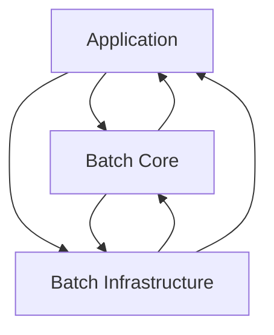

# Spring Batch

## 소개

### 탄생 배경

배치 처리에서 요구하는 재사용 가능한 자바 기반 배치 아키텍처 표준의 필요성이 대두되어 탄생함

SpringSource (현재 Pivotal) + Accenture (경영 컨설팅 기업) 의 합작품
* Accenture - 배치 아키텍처를 구현하면서 쌓은 기술적인 경험과 노하우
* SpringSource - 깊이 있는 기술적 기반과 스프링의 프로그래밍 모델

Accenture 가 이전에 소유한 배치 처리 아키텍처 프레임워크를 Spring Batch 프로젝트에 기증함

### 핵심 패턴

* Read - 데이터베이스, 파일, 큐에서 다량의 데이터를 조회
* Process - 특정 방법으로 데이터를 가공
* Write - 데이터를 수정된 양식으로 다시 저장

> ETL (Extract, Transform, Load) 와 매칭된다.

### 배치 시나리오

* 배치 프로세스를 주기적으로 커밋
* 동시 다발적인 Job 의 배치 처리, 대용량 병렬 처리
* 실패 후 수동 또는 스케줄링에 의한 재시작
* 의존 관계가 있는 step 여러 개를 순차적으로 처리
* 조건적 Flow 구성을 통한 체계적이고 유연한 배치 모델 구성
* 반복, 재시도, Skip 처리

## 아키텍처

> https://docs.spring.io/spring-batch/docs/current/reference/html/spring-batch-intro.html#springBatchArchitecture

### Application

* 개발자가 만든 모든 배치 Job 과 커스텀 코드를 포함
* 개발자는 업무 로직의 구현에만 집중하고, 공통적인 기반 기술은 프레임워크가 담당하게 한다.

### Batch Core

* Job 을 실행, 모니터링, 관리하는 API 로 구성되어 있다.
* `JobLauncher`, `Job`, `Step`, `Flow` 등이 속한다.

### Batch Infrastructure

* Application, Core 모두 공통 Infrastructure 위에서 빌드한다.
* Job 실행의 흐름과 처리를 위한 틀을 제공한다.
* `Reader`, `Processor Writer`, `Skip`, `Retry` 등이 속한다.