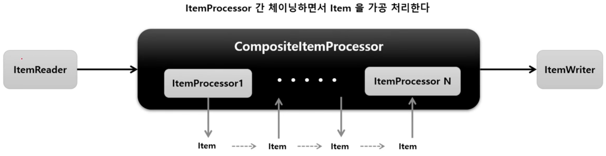

# CompositeItemProcessor

ItemProcessor 들을 연결(Chaining) 해서 위임하면 각 ItemProcessor 를 실행시킨다.

이전 ItemProcessor 반환 값은 다음 ItemProcessor 값으로 연결된다.

## API

```java
public ItemProcessor itemProcessor() {
    return new CompositeItemProcessorBuilder<>()
        // 체이닝할 ItemProcessor 객체 설정
        .delegates(ItemProcessor<?, ?>... delegates)
        .build();
}
```

