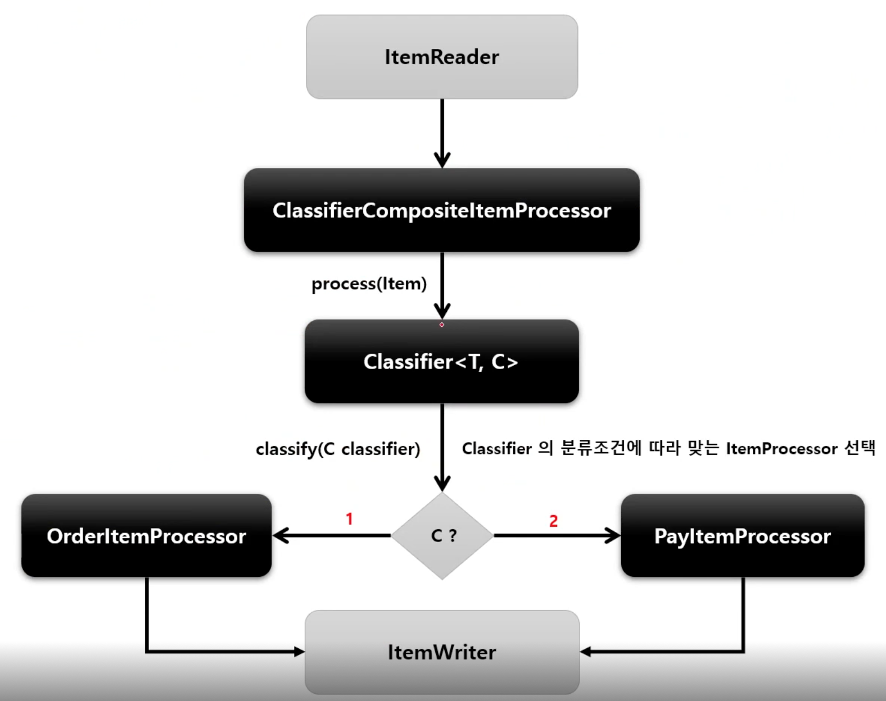

# ClassifierCompositeItemProcessor

Classifier 로 라우팅 패턴을 구현해서 ItemProcessor 구현체 중에서 하나를 호출하는 역할을 한다.

## API

```java
public ItemProcessor itemProcessor() {
    return new ClassifierCompositeItemProcessorBuilder<>()
        // 분류자 설정
        .classifier(Classifier)
        .build();
}
```

```
Classifier<C, T>

// C 의 분류에 따라 적절한 T 를 반환
T classify(C classifiable)
```

