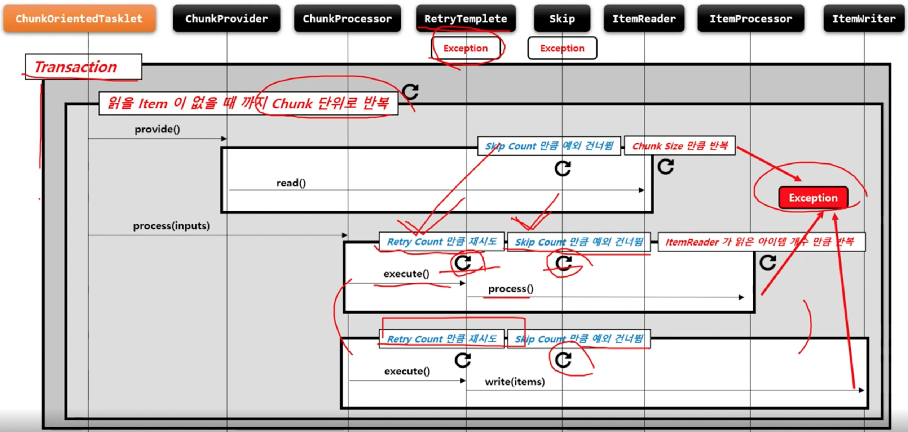

# FaultTolerant

스프링 배치는 Job 실행 중에 오류가 발생할 경우, 장애를 처리하기 위한 기능을 제공하며 이를 통해 복원력을 향상시킬 수 있다.

오류가 발생해도 Step 이 즉시 종료되지 않고, Retry 혹은 Skip 기능을 활성화 함으로써 내결함성 서비스가 가능하도록 한다.

프로그램의 내결함성을 위해 Skip 과 Retry 기능을 제공한다.

* Skip
    + ItemReader / ItemProcessor / ItemWriter 에 적용할 수 있다.
* Retry
    + ItemProcessor / ItemWriter 에 적용할 수 있다.

FaultTolerant 구조는 청크 기반의 프로세스 기반 위에 Skip 과 Retry 기능이 추가되어 재정의 되어 있다.


## API

StepBuilderFactory > StepBuilder > FaultTolerantStepBuilder > TaskletStep

```java
public Step batchStep() {
    return new StepBuilderFactory.get("batchStep")
        .<I, O> chunk(10)
        .reader(itemReader)
        .writer(itemWriter)
        // 내결함성 기능 활성화
        .faultTolerant()
        // 예외 발생 시 Skip 할 예외 타입 설정
        .skip(Class<? extends Throwable> type)
        // Skip 제한 횟수 설정
        .skipLimit(int skipLimit)
        // 예외 발생 시 Skip 하지 않을 예외 타입 설정
        .noSkip(Class<? extends Throwable> type)
        // 예외 발생 시 Retry 할 예외 타입 설정
        .retry(Class<? extends Throwable> type)
        // Retry 제한 횟수 설정
        .retryLimit(int retryLimit)
        // 다시 Retry 하기 까지의 지연시간 (단위: ms) 을 설정
        .backOffPolicy(BackOffPolicy backOffPolicy)
        // 예외 발생 시 Retry 하지 않을 예외 타입 설정
        .noRetry(Class<? extends Throwable> type)
        // 예외 발생 시 Rollback 하지 않을 예외 타입 설정
        .noRollback(Class<? extends Throwable> type)
        .build();
}
```

