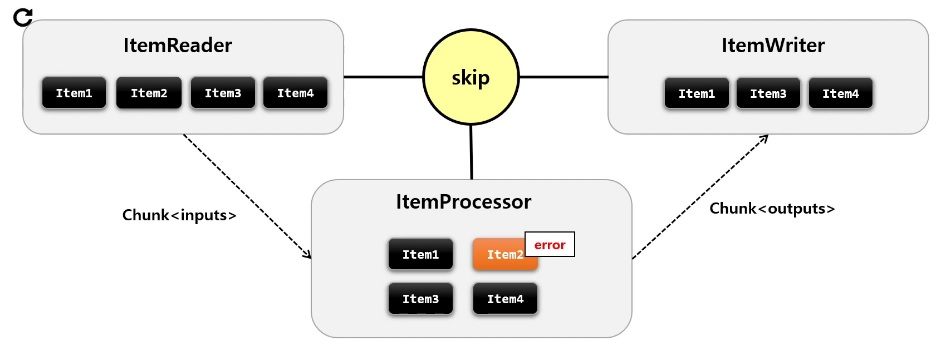
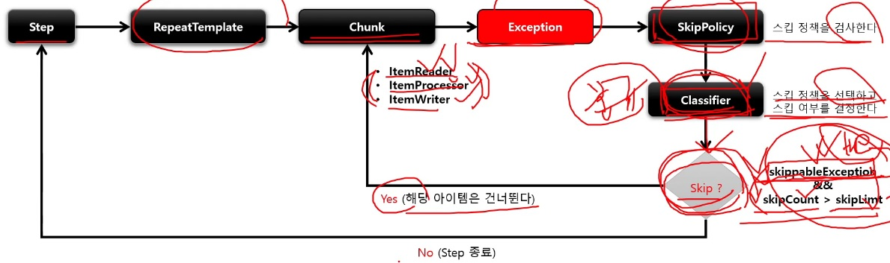
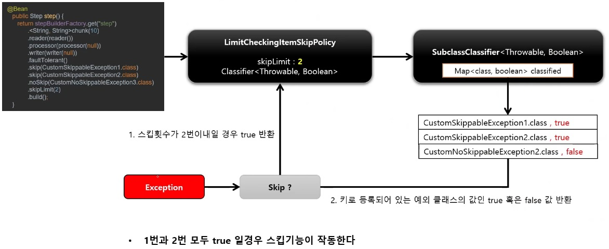
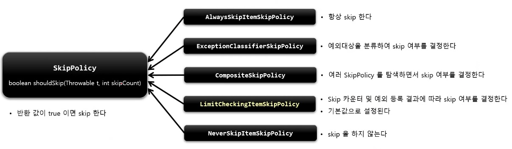

# Skip

Skip 은 데이터를 처리하는 동안 설정된 Exception 이 발생했을 경우, 해당 데이터 처리를 건너뛰는 기능이다.

데이터의 사소한 오류에 대해 Step 의 실패처리 대신 Skip 을 함으로써, 배치 수행의 빈번한 실패를 줄일 수 있게 한다.



* 오류 발생 시 Skip 설정에 의해서 Item2 번은 건너뛰고, Item3 번부터 다시 처리한다.
* `ItemReader` 는 예외가 발생하면 해당 아이템만 스킵하고 계속 진행한다.
* `ItemProcessor` 와 `ItemWriter` 는 예외가 발생하면 (같은 단계에서) Chunk 의 처음으로 돌아가서 스킵된 아이템을 제외한 나머지 아이템들을 가지고 처리하게 된다.

> [1,2,3,4,5,6] 의 아이템을 ItemReader 에서 3 에서 오류나면, [1,2,4,5,6] 만 진행된다.

> [1,2,4,5,6] 의 아이템을 ItemProcessor 에서 4 에서 오류나면, ItemProcessor 에서 1 부터 **다시** 진행해서 [1,2,5,6] 이 진행된다.

> [1,2,5,6] 의 아이템을 ItemWriter 에서 5 에서 오류나면, ItemProcessor 에서 1 부터 **다시** 진행되서 [1,2,6] 이 진행된다.

* Skip 기능은 내부적으로 SkipPolicy 를 통해[서 구현되어 있다.
* Skip 가능 여부를 판별하는 기준은 다음과 같다.
    1. 스킵 대상에 포함된 예외인지 여부
    2. 스킵 카운터를 초과했는지 여부





# SkipPolicy

스킵 정책에 따라 아이템의 Skip 여부를 판단하는 클래스. 

스프링 배치가 기본적으로 제공하는 SkipPolicy 구현체들이 있으며, 필요 시 직접 생성해서 사용할 수 있다. 그리고 내부적으로 Classifier 클래스들을 활용하고 있다.



## API

```java
public Step batchStep() {
    return stepBuilderFactory.get("batchStep")
        .<I, O> chunk(10)
        .reader(itemReader)
        .writer(itemWriter)
        .faultTolerant()
        // 예외 발생 시 Skip 할 예외 타입 설정
        .skip(Class<? extends Throwable> type)
        // Skip 제한 횟수 설정. ItemReader, ItemProcessor, ItemWriter 횟수 합이다.
        .skipLimit(int skipLimit)
        // Skip 을 어떤 조건과 기준으로 적용할 것인지 정책 설정
        .skipPolicy(SkipPolicy skipPolicy)
        // 예외 발생 시 Skip 하지 않을 예외 타입 설정
        .noSkip(Class<? extends Throwable> type)
        .build();
}
```