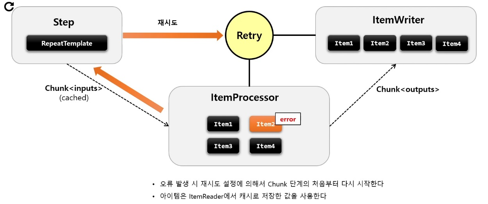
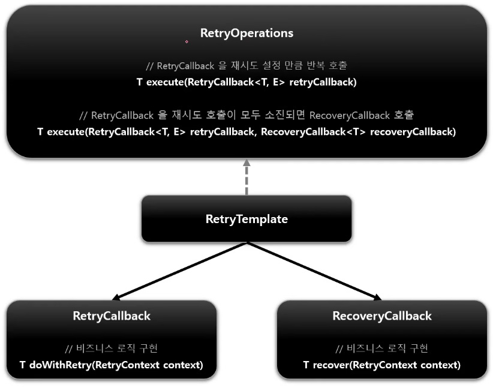
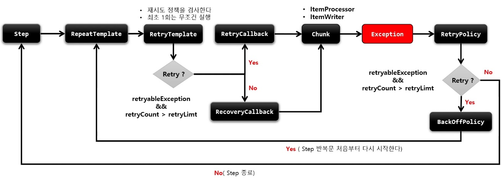
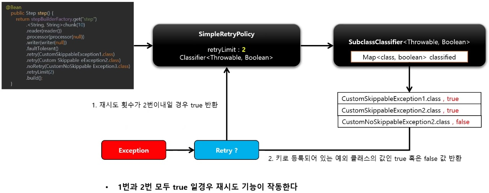
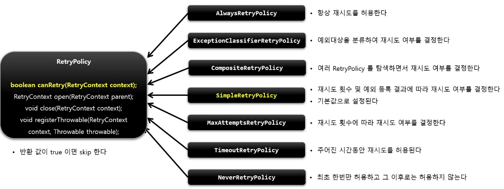
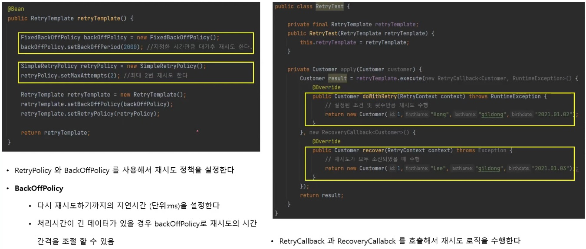

# Retry

Retry 는 `ItemProcess`, `ItemWriter` 에서 설정된 Exception 이 발생했을 경우, 지정한 정책에 따라 데이터 처리를 재시도하는 기능이다.

Skip 과 마찬가지로 Retry 를 함으로써, 배치수행의 빈번한 실패를 줄일 수 있게 한다.



> `ItemProcessor`, `ItemWriter` 에서 오류 발생 시 Step 부터 다시 진행한다.



Retry 기능은 내부적으로 RetryPolicy 를 통해서 구현되어 있다.

Retry 가능 여부를 판별하는 기준은 다음과 같다.

1. 재시도 대상에 포함된 예외인지 여부
2. 재시도 카운터를 초과했는지 여부





# RetryPolicy

재시도 정책에 따라 아이템의 Retry 여부를 판단하는 클래스

기본적으로 제공하는 RetryPolicy 구현체들이 있으며 필요 시 직접 생성해서 사용할 수 있다.





## API

```java
public Step batchStep() {
    return stepBuilderFactory.get("batchStep")
        .<I, O> chunk(10)
        .reader(itemReader)
        .writer(itemWriter)
        .faultTolerant()
        // 예외 발생 시 Retry 할 예외 타입 설정
        .retry(Class<? extends Throwable> type)
        // Retry 제한 횟수 설정
        .retryLimit(int retryLimit)
        // Retry 를 어떤 조건과 기준으로 적용할 것인지 정책 설정
        .retryPolicy(SkipPolicy retryPolicy)
        // 예외 발생 시 Retry 하지 않을 예외 타입 설정
        .noRetry(Class<? extends Throwable> type)
        // 다시 Retry 하기 까지의 지연시간(단위:ms) 를 설정
        .backOffPolicy(BackoffPolicy backoffPolicy)
        // 예외 발생 시 Rollback 하지 않을 예외 타입 설정
        .noRollback(Class<? extends Throwable> type)
        .build();
}
```

Skip 과 Retry 는 서로 보완적인 관계에 있음

ItemProcess execute 로 recover 작성 시 state 가 없으면 다시 초기 chunk 로 돌아가지 않는다. (new DefaultRetryState())