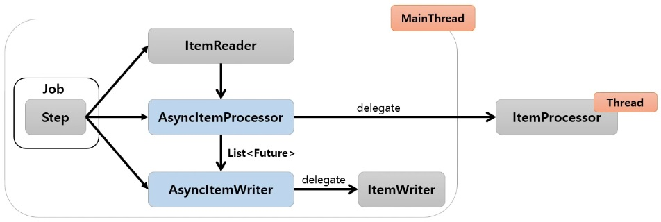
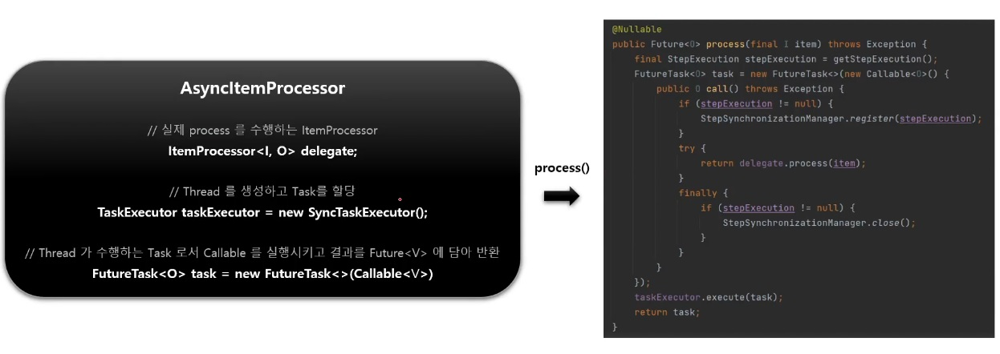
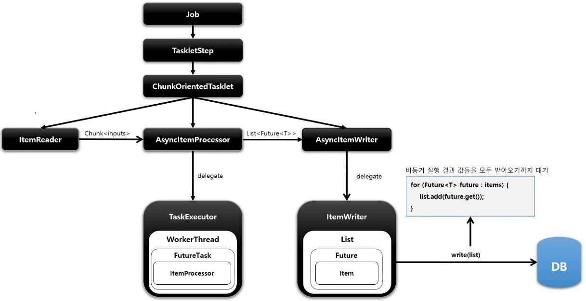

# AsyncItemProcessor

`Step` 안에서 `ItemProcessor` 가 비동기적으로 동작하는 구조

`AsyncItemProcessor` 와 `AsyncItemWriter` 가 함께 구성이 되어야 함

`AsyncItemProcessor` 로부터 `AsyncItemWriter` 가 받는 최종 결과값은 `List<Future<T>>` 타입이며 비동기 실행이 완료될 때까지 대기한다.

> spring-batch-integration 의존성이 필요하다.

## 구조







## API

```java
public Step steps() throws Exception {
    // Step 기본 설정
    return stepBuilderFactory.get("step")
        // Chunk 개수 설정
        .chunk(100)
        // ItemReader 설정 (비동기 실행 아님)
        .reader(pagingItemReader())
        // 비동기 실행을 위한 AsyncItemProcessor 설정
        // - 청크 개수 혹은 스레드 풀 개수만큼 스레드가 생성되어 비동기로 실행된다.
        // - 내부적으로 실제 ItemProcessor 에게 실행을 위임하고 결과를 Future 에 저장한다.
        .processor(asyncItemProcessor())
        // AsyncItemWriter 설정
        // - 비동기 실행 결과 값들을 모두 받아오기까지 대기함
        // - 내부적으로 실제 ItemWriter 에게 최종 결과값을 넘겨주고 실행을 위임한다.
        .writer(asyncItemWriter())
        // TaskletStep 생성
        .build();
}
```