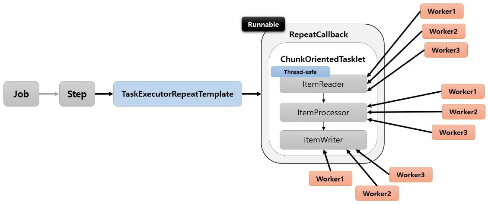
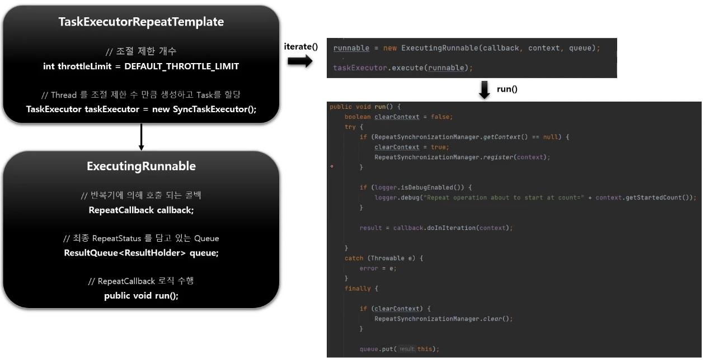
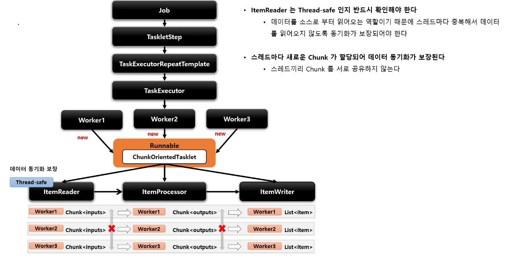

# Multi-threaded Step

Step 내에서 멀티스레드로 Chunk 기반 처리가 이루어지는 구조

`TaskExecutorRepeatTemplate` 가 반복적으로 사용되며 설정한 개수(throttleLimit) 만큼의 스레드를 생성하여 수행한다.



## 구조



`DEFAULT_THROTTLE_LIMIT` 은 기본적으로 4개



ChunkOrientedTasklet 을 각 스레드에서 생성되는 것이 아니라 ItemReader, ItemProcessor, ItemWriter 에서 Chunk 를 다룰 때 각 Worker 에서 다루도록 진행된다.

아이템은 LIFO(Last In First Out) 로 작동됨

## API

```java
public Step step() throws Exception {
    return stepBuilderFactory.get("step")
        .<Customer, Customer> chunk(100)
        // Thread-safe 한 ItemReader 설정
        .reader(pagingItemReader())
        .processor(customerItemProcessor())
        .writer(customerItemWriter())
        // 스레드 생성 및 실행을 위한 설정
        .taskExecutor(taskExecutor())
        .build();
}
```