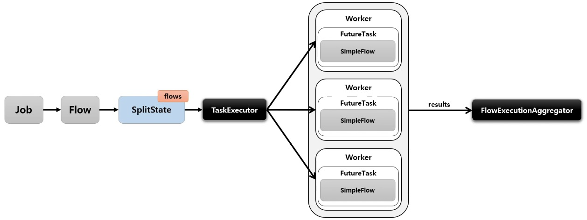
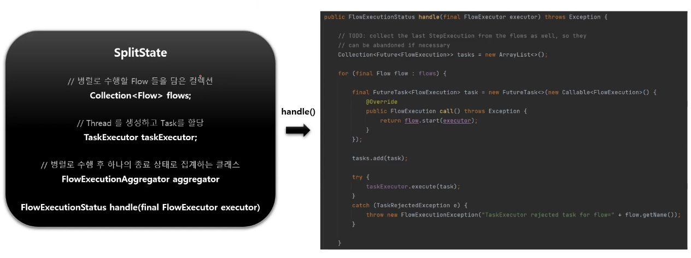

# Parallel Steps

`SplitState` 를 사용해서 여러 개의 `Flow` 들을 병렬적으로 실행하는 구조

실행이 다 완료된 후 `FlowExecutionStatus` 결과들을 취합해서 다음 단계 결정을 한다.



Thread safe 하지 않기 때문에 동시성 처리를 고려해야 한다.

## 구조

주요 특징은 여러 개의 `Flow` 들을 취급한다는 점이다.




## API

```java
public Job job() {
    return jobBuilderFactory.get("job")
        // Flow 1 을 생성한다.
        .start(flow1())
        // Flow 2 와 3 를 생성하고 총 3개의 Flow 를 합친다.
        // - taskExecutor 에서 flow 개수만큼 스레드를 생성해서 각 flow 를 실행시킨다.
        .split(TastExecutor).add(flow2(), flow3())
        // Flow 4 는 split 처리가 완료된 후 실행이 된다.
        .next(flow4())
        .end()
        .build();
}
```