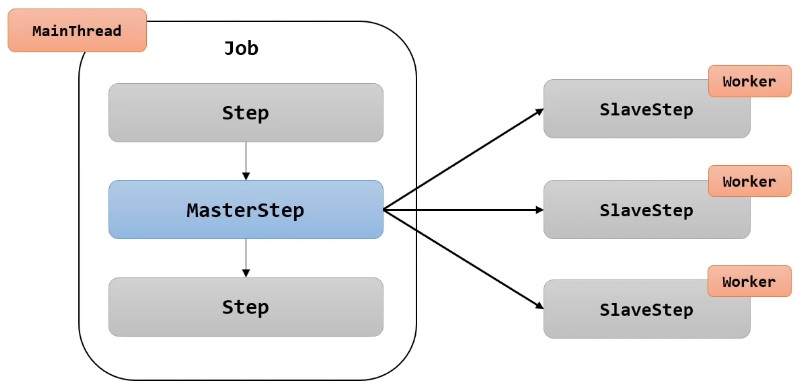
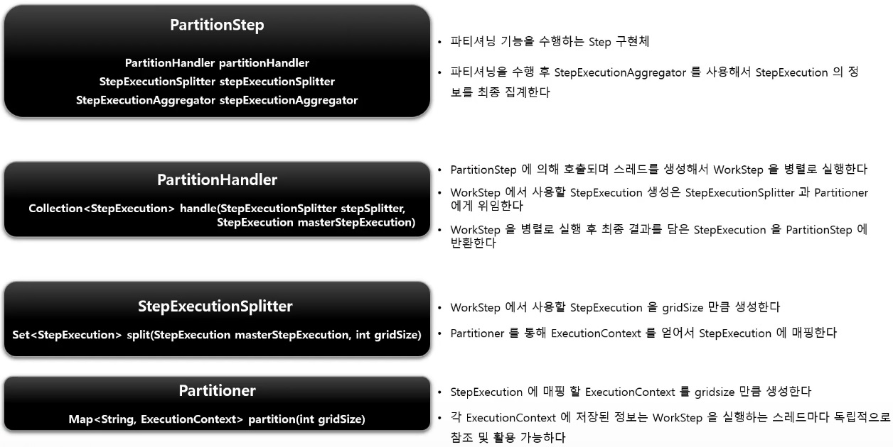
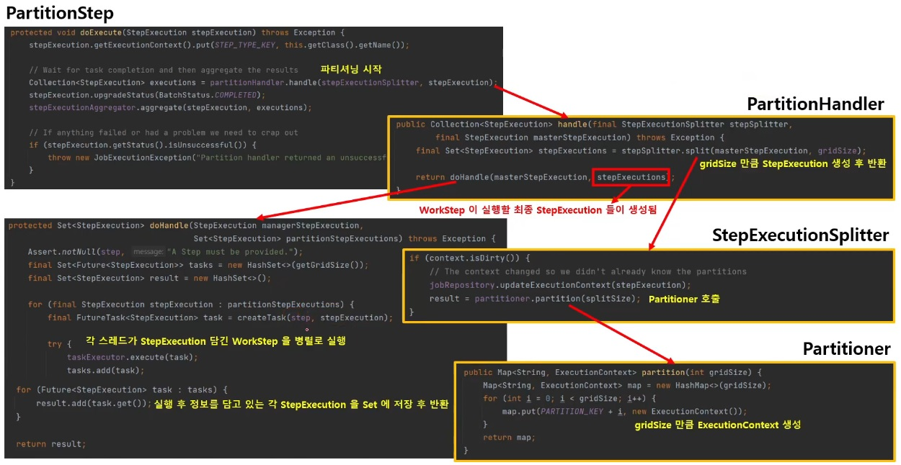
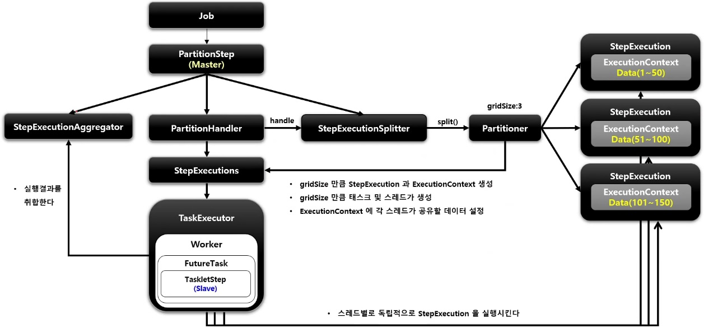
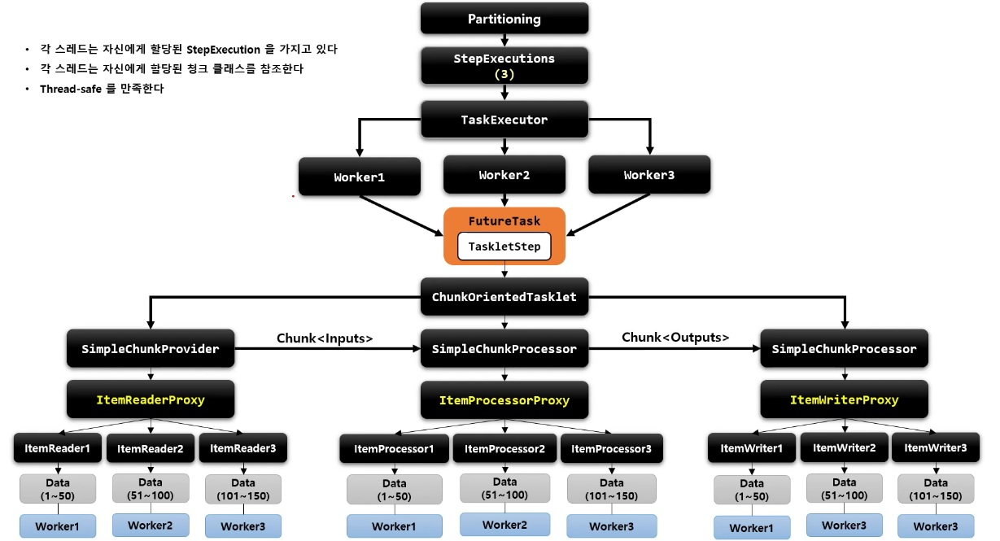

# Partitioning 

`MasterStep` 이 `SlaveStep` 을 실행시키는 구조

`SlaveStep` 은 각 스레드에 의해 독립적으로 실행됨

`SlaveStep` 은 독립적인 `StepExecution` 파라미터 환경을 구성함

`SlaveStep` 은 `ItemReader` / `ItemProcessor` / `ItemWriter` 등을 가지고 동작하며 작업을 독립적으로 병렬 처리한다.

`MasterStep` 은 `PartitionStep` 이며 `SlaveStep` 은 `TaskletStep`, `FlowStep` 등이 올 수 있다.



## 구조









## API

```java
public Step step() throws Exception {
    // Step 기본 설정
    return stepBuilderFactory.get("masterStep")
        // ParitionStep 생성을 위한 PartitionStepBuilder 가 생성되고 Partitioner 를 설정
        .partitioner("slaveStep", new ColumnRangePartitioner())
        // Slave 역할을 하는 Step 을 설정: TaskletStep, FlowStep 등이 올 수 있음
        .step(slaveStep())
        // 파티션 구분을 위한 값 설정: 몇 개의 파티션으로 나눌 것인지 사용됨
        .gridSize(4)
        // 스레드 풀 실행자 설정: 스레드 생성, 스레드 풀 관리
        .taskExecutor(ThreadPoolTaskExecutor())
        // PartitionStep 생성: MasterStep 의 역할 담당
        .build();
}
```