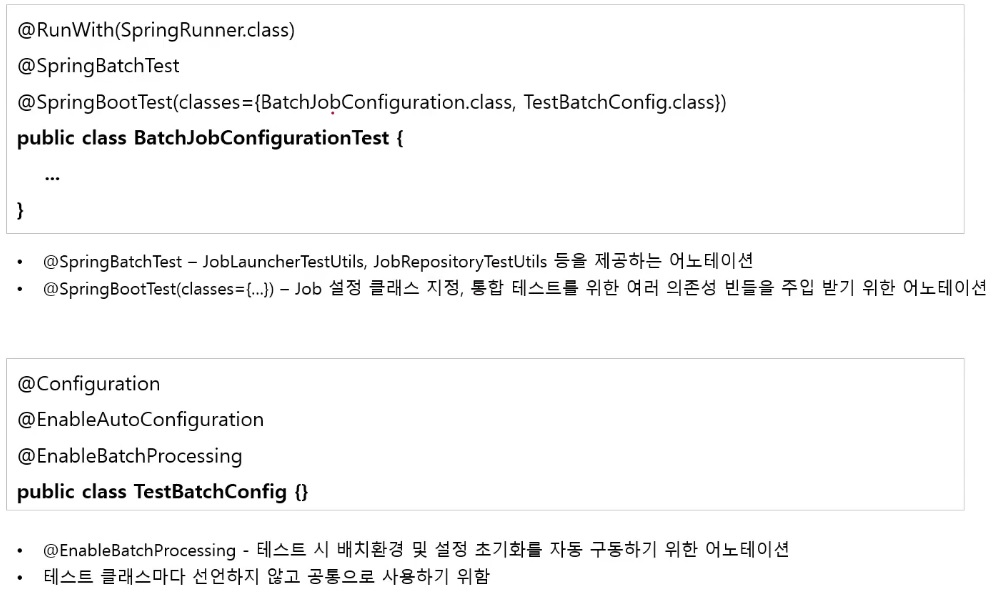

# Spring Batch Test

org.springframework.batch - spring-batch-test 의존성 추가

## `@SpringBatchTest`

자동으로 `ApplicationContext` 에 테스트에 필요한 여러 유틸 Bean 을 등록해주는 어노테이션

* JobLauncherTestUtils - `launchJob()`, `launchStep()` 과 같은 스프링 배치 테스트에 필요한 유틸성 메소드 지원
* JobRepositoryTestUtils - `JobRepository` 를 사용해서 `JobExecution` 을 생성 및 삭제 기능 메소드 지원
* StepScopeTestExecutionListener - `@StepScope` 컨텍스트를 생성해주며 해당 컨텍스트를 통해 `JobParameter` 등을 단위 테스트에서 DI 받을 수 있다.
* JobScopeTestExecutionListener - `@JobScope` 컨텍스트를 생성해주며 해당 컨텍스트를 통해 `JobParameter` 등을 단위 테스트에서 DI 받을 수 있다.

## 구조

## Usage

