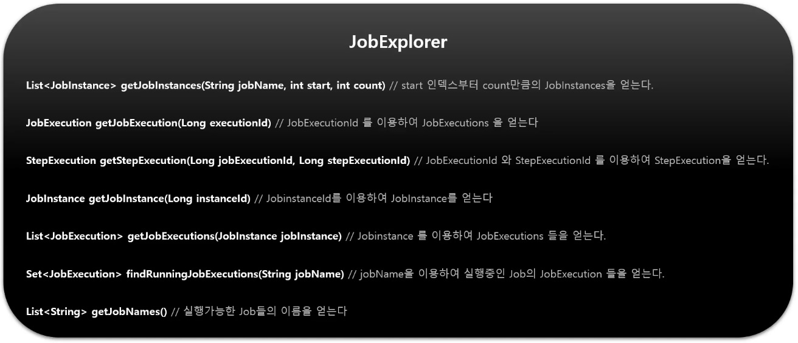
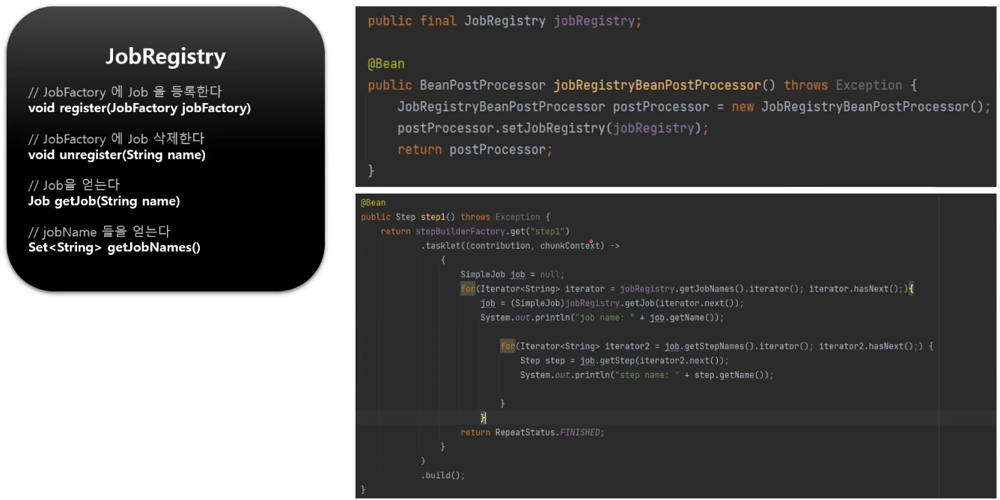
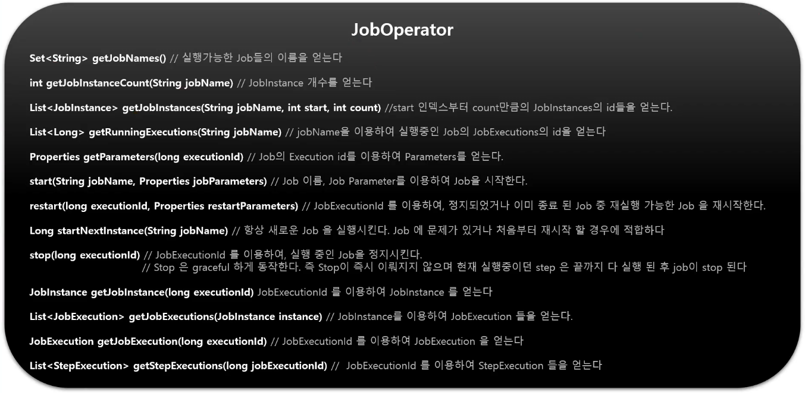

# JobExplroer, JobRegistry, JobOperator

## JobExplorer

JobRepository 의 readonly 버전

실행 중인 Job 의 실행 정보인 JobExecution 또는 Step 의 실행 정보인 StepExecution 을 조회할 수 있다.



## JobRegistry

생성된 Job 을 자동으로 등록, 추적 및 관리하며 여러 곳에서 Job 을 생성한 경우, ApplicationContext 에서 Job 을 수집해서 사용할 수 있다.

기본 구현체로 map 기반의 MapJobRegistry 클래스를 제공한다. (JobName 을 Key 로 하고 Job 을 값으로 하여 매핑)

Job 등록 - JobRegistryBeanPostProcessor - BeanPostProcessor 단계에서 bean 초기화 시 자동으로 JobRegistry 에 Job 을 등록시켜준다.



## JobOperator

JobExplorer, JobRepository, JobRegistry, JobLauncher 를 포함하고 있으며 배치의 중단 / 재시작 / job 요약 등의 모니터링이 가능하다.

기본 구현체로 SimpleJobOperator 클래스를 제공한다.



# 예시

```java
@RestController
public class JobController {
    @Autowired
    private JobRegistry jobRegistry;
    @Autowired
    private JobExplorer jobExplorer;
    @Autowired
    private JobOperator jobOperator;

    @PostMapping(value = "/batch/start")
    public String start(@RequestBody JobInfo jobInfo) throws NoSuchJobException, JobInstanceAlreadyExistsException {
        for (Iterator<String> iterator = jobRegistry.getJobNames().iterator(); iterator.hasNext();) {
            Job job = (SimpleJob)jobRegistry.getJob(iterator.next());
            System.out.println("jobName: " + job.getName());

            jobOperator.start(job.getName(), "id=" + jobInfo.getId());
        }
        return "batch is started";
    }

    @PostMapping(value = "/batch/stop")
    public String stop(@RequestBody JobInfo jobInfo) throws NoSuchJobException, JobInstanceAlreadyExistsException {
        for (Iterator<String> iterator = jobRegistry.getJobNames().iterator(); iterator.hasNext();) {
            Job job = (SimpleJob)jobRegistry.getJob(iterator.next());
            System.out.println("jobName: " + job.getName());

            Set<JobExecution> runningJobExecutions = jobExplorer.findRunningJobExecutions(job.getName());
            JobExecution next = runningJobExecutions.iterator().next();

            jobOperator.stop(jobExecution.getId());
        }
        return "stop";
    }

    @PostMapping(value = "/batch/restart")
    public String restart(@RequestBody JobInfo jobInfo) throws NoSuchJobException, NoSuchJobExecutionException, JobExecutionNotRunningException {
        for (Iterator<String> iterator = jobRegistry.getJobNames().iterator(); iterator.hasNext();) {
            Job job = (SimpleJob)jobRegistry.getJob(iterator.next());
            System.out.println("jobName: " + job.getName());

            JobInstance lastJobInstance = JobExplorer.getLastJobInstance(job.getName());
            JobExecution lastJobExecution = jobExplorer.getLastJobExecution(lastJobInstance);
            jobOperator.restart(lastJobInstance);
        }
        return "restart";
    }
}
```