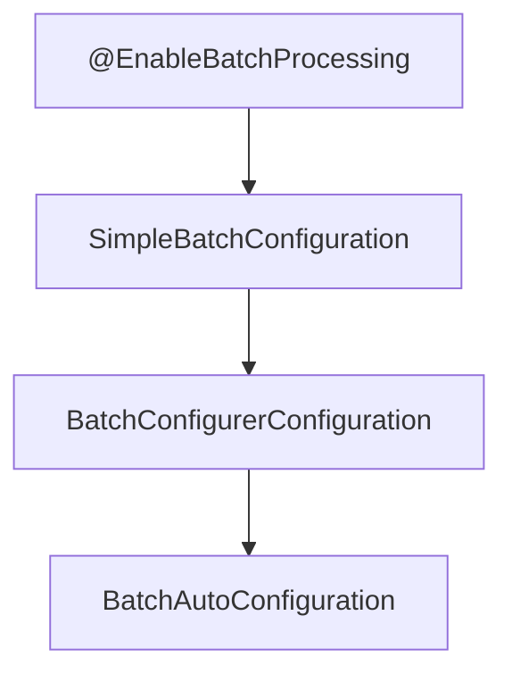

# Spring Batch 프로젝트 구성

## Dependencies

Spring Boot 2.7.0, Spring Batch Core 4.3.6, Gradle 기준

```groovy
// Lombok
compileOnly 'org.projectlombok:lombok'
annotationProcessor 'org.projectlombok:lombok'

// Spring Boot Batch
implementation 'org.springframework.boot:spring-boot-starter-batch'
// Spring Data JPA/JDBC
//implementation 'org.springframework.//boot:spring-boot-starter-data-jdbc'
//implementation 'org.springframework.//boot:spring-boot-starter-data-jpa'

// H2 DB
runtimeOnly 'com.h2database:h2'
// MySQL Driver
//runtimeOnly 'mysql:mysql-connector-java'

// Spring Boot Test
testImplementation 'org.springframework.boot:spring-boot-starter-test'
testImplementation 'org.springframework.batch:spring-batch-test'
```

## 배치 활성화

`@EnableBatchProcessing`

main 클래스에 위의 Annotation 을 추가한다.

* 스프링 배치가 작동하기 위해 선언해야 하는 Annotation
* **총 4개의 설정 클래스를 실행**시키고, **스프링 배치의 모든 초기화 및 실행 구성이 이루어진다.**
* 자동 설정 클래스가 실행되면서 빈으로 등록된 모든 Job 을 검색하여 초기화와 동시에 Job 을 수행하도록 구성됨

```java
package kr.pe.karsei.springbatchstudy;

import org.springframework.batch.core.configuration.annotation.EnableBatchProcessing;
import org.springframework.boot.SpringApplication;
import org.springframework.boot.autoconfigure.SpringBootApplication;

@SpringBootApplication
@EnableBatchProcessing
public class SpringbatchstudyApplication {
    public static void main(String[] args) {
        SpringApplication.run(SpringbatchstudyApplication.class, args);
    }
}
```

### 스프링 배치 초기화 설정 클래스



**BatchAutoConfiguration**
* 스프링 배치가 초기화될 때 자동으로 실행되는 설정 클래스
* Job 을 수행하는 `JobLauncherApplicationRunner` Bean 을 생성

**SimpleBatchConfiguration**
* `JobBuilderFactory` 와 `StepBuilderFactory` 생성
* 스프링 배치의 주요 구성 요소 생성 -> **프록시 객체로 생성됨**

**BatchConfigurerConfiguration**
* `BasicBatchConfigurer`
  + `SimpleBatchConfiguration` 에서 생성한 프록시 객체의 실제 대상 객체를 생성하는 설정 클래스
  + Bean 으로 의존성 주입받아서 주요 객체들을 참조하여 사용할 수 있다.
* `JpaBatchConfigurer`
  + JPA 관련 객체를 생성하는 설정 클래스
* 사용자 정의 BatchConfigurer 인터페이스를 구현하여 사용 가능


