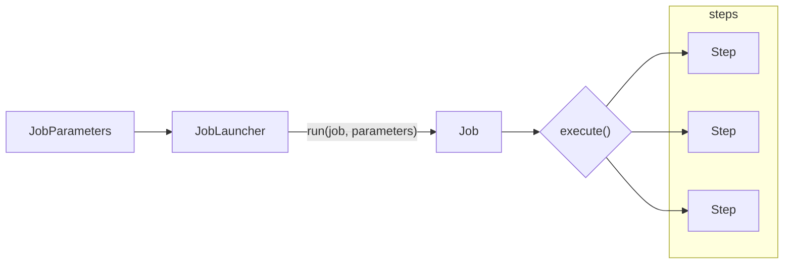
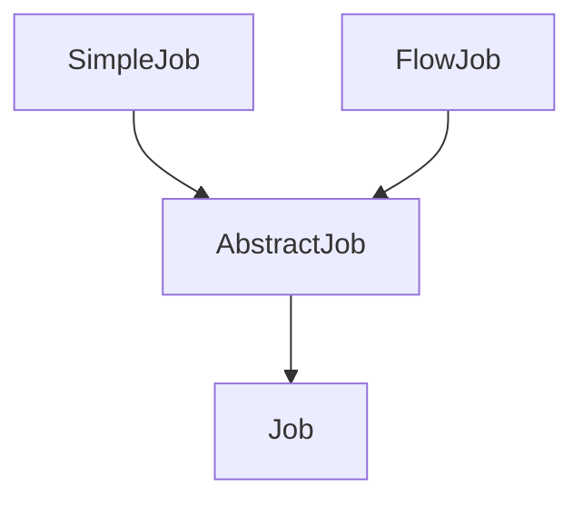
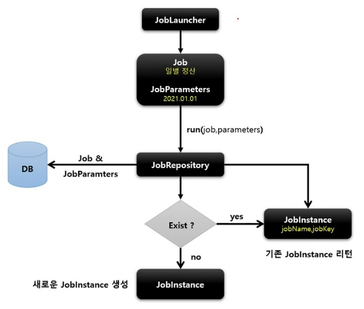
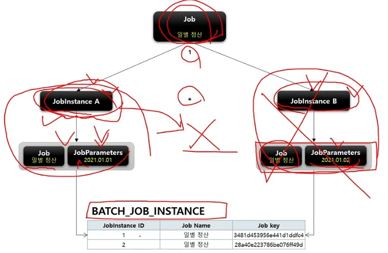

# 스프링 배치 도메인 이해

## Job

배치 계층 구조에서 가장 상위에 있는 개념으로서 **하나의 배치 작업** 자체를 의미함

> 예시 - 'API 서버의 접속 로그 데이터를 통계 서버로 옮기는 배치' 인 Job 자체를 의미

* Job Configuration 을 통해 생성되는 객체 단위로서 배치 작업을 어떻게 구성하고 실행할 것인지 전체적으로 설정하고 명세해 놓은 객체
* 배치 Job 을 구성하기 위한 최상위 인터페이스이며 스프링 배치가 기본 구현체를 제공함
* 여러 Step 을 포함하고 있는 컨테이너로서 반드시 한 개 이상의 Step 으로 구성해야 함

* 기본 구현체
    * **SimpleJob**
        + 순차적으로 `Step` 을 실행시키는 `Job`
        + 모든 Job 에서 유용하게 사용할 수 있는 표준 기능을 갖고 있음
    * **FlowJob**
        + 특정한 조건과 흐름에 따라 `Step` 을 구성하여 실행시키는 `Job`
        + `Flow` 객체를 실행시켜서 작업을 진행함

### JobInstance

Job 이 실행될 때 생성되는 Job 의 논리적 실행 단위 객체로서 고유하게 식별 가능한 작업을 실행

Job 의 설정과 구성을 동일하나 Job 이 실행되는 시점에 처리하는 내용은 다르기 때문에 Job 의 실행을 구분해야 함

> 하루에 한 번 씩 배치 Job 이 실행된다면 매일 실행되는 각각의 Job 을 JobInstace 로 표현한다

#### 실행 및 생성
+ 처음 시작하는 Job + JobParameter 실행 -> 새로운 JobInstace 생성
+ 이전과 동일한 Job + JobParameter 실행 -> 이미 존재하는 JobInstace 반환
    + 결과는 **실패**함
    + 내부적으로 JobName + JobKey (JobParameters 의 해시값) 를 가지고 JobInstance 객체를 얻음
+ Job 과는 일대다 관계

#### BATCH_JOB_INSTANCE Table 매핑

`JOB_NAME` (Job) 과 `JOB_KEY` (JobParrameter 해시값) 가 동일한 데이터는 중복해서 저장할 수 없음

> 즉, `JobInstance` 는 DB 저장될 때 오직 유일한 값만 저장된다.

#### Flow

여기서 `JobRepository` 는 메타데이터를 저장하는 객체이며 DB 에서 Job 이 처음 실행된 것인지, 이전에 실행된 것인지 확인한다.

이전에 실행된 것이면 기존 `JobInstance` 를 반환하며 예외가 발생한다.

### JobParameter

### JobExecution

## Step

### StepExecution

### StepContribution

## ExecutionContext

## JobRepository / JobLauncher