# 스프링 배치 도메인 이해

## Job

배치 계층 구조에서 가장 상위에 있는 개념으로서 **하나의 배치 작업** 자체를 의미함

> 예시 - 'API 서버의 접속 로그 데이터를 통계 서버로 옮기는 배치' 인 Job 자체를 의미

* Job Configuration 을 통해 생성되는 객체 단위로서 배치 작업을 어떻게 구성하고 실행할 것인지 전체적으로 설정하고 명세해 놓은 객체
* 배치 Job 을 구성하기 위한 최상위 인터페이스이며 스프링 배치가 기본 구현체를 제공함
* 여러 Step 을 포함하고 있는 컨테이너로서 반드시 한 개 이상의 Step 으로 구성해야 함

* 기본 구현체
    * **SimpleJob**
        + 순차적으로 `Step` 을 실행시키는 `Job`
        + 모든 Job 에서 유용하게 사용할 수 있는 표준 기능을 갖고 있음
    * **FlowJob**
        + 특정한 조건과 흐름에 따라 `Step` 을 구성하여 실행시키는 `Job`
        + `Flow` 객체를 실행시켜서 작업을 진행함

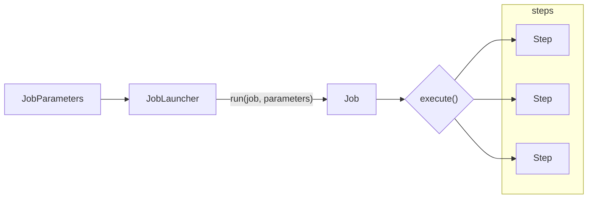
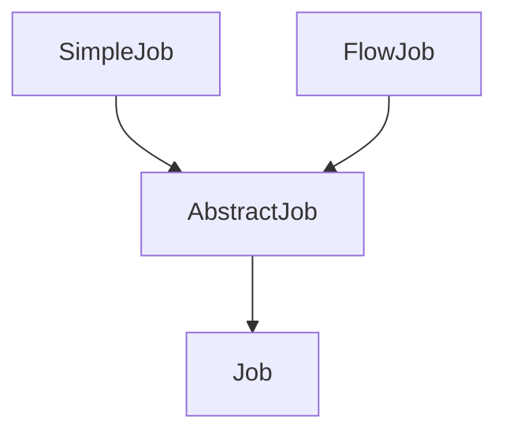

### JobInstance

Job 이 실행될 때 생성되는 Job 의 논리적 실행 단위 객체로서 고유하게 식별 가능한 작업을 실행

Job 의 설정과 구성을 동일하나 Job 이 실행되는 시점에 처리하는 내용은 다르기 때문에 Job 의 실행을 구분해야 함

> 하루에 한 번 씩 배치 Job 이 실행된다면 매일 실행되는 각각의 Job 을 JobInstace 로 표현한다

#### 실행 및 생성
+ 처음 시작하는 Job + JobParameter 실행 -> 새로운 JobInstace 생성
+ 이전과 동일한 Job + JobParameter 실행 -> 이미 존재하는 JobInstace 반환
    + 결과는 **실패**함
    + 내부적으로 JobName + JobKey (JobParameters 의 해시값) 를 가지고 JobInstance 객체를 얻음
+ Job 과는 일대다 관계

#### `BATCH_JOB_INSTANCE` Table 매핑

`JOB_NAME` (Job) 과 `JOB_KEY` (`JobParameter` 해시값) 가 동일한 데이터는 중복해서 저장할 수 없음

> 즉, `JobInstance` 는 DB 저장될 때 오직 유일한 값만 저장된다.

#### Flow

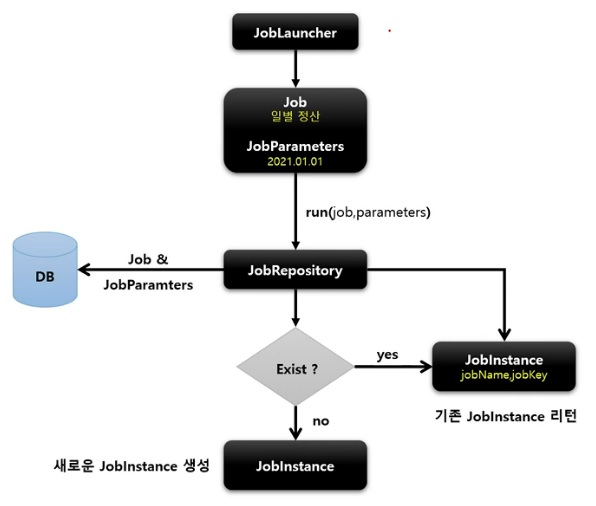

여기서 `JobRepository` 는 메타데이터를 저장하는 객체이며 DB 에서 Job 이 처음 실행된 것인지, 이전에 실행된 것인지 확인한다.

이전에 실행된 것이면 기존 `JobInstance` 를 반환하며 예외가 발생한다.

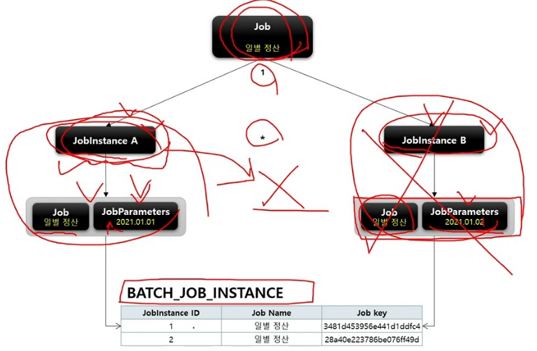

### JobParameter

* `Job` 을 실행할 때 함께 포함되어 사용되는 파라미터를 가진 도메인 객체
* 하나의 Job 에 존재할 수 있는 여러 개의 `JobInstance` 를 구분하기 위한 용도
* `JobParameters` 와 `JobInstance` 는 1:1 관계

#### 생성 및 바인딩

* Application 실행 시 주입
```bash
$ java -jar LogBatch.jar requestDate=20220611 seq(long)=2L date(date)=2022/06/11
```
* 코드로 생성 - `JobParameterBuilder`, `DefaultJobParametersConverter`
* SpEL(Spring Expression Language) 이용 - `@Value("#{jobParameter[requestDate]}")`, `@JobScope`, `@StepScope` 선언 필수

#### `BATCH_JOB_EXECUTION_PARAM` 테이블과 매핑

`JOB_EXECUTION` 과 1:M 의 관계

#### Flow

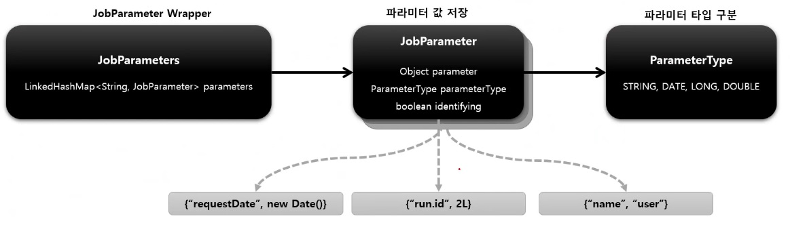

위의 그림에서 마지막으로 `BATCH_JOB_EXECUTION_PARAM` 테이블에 저장된다.

### JobExecution

`JobInstance` 에 대한 한 번의 시도를 의미하는 객체로서 `Job` 실행 중에 발생한 정보들을 저장하고 있는 객체
> 시작시간, 종료시간, 상태(시작됨, 완료, 실패), 종료상태의 속성을 가진다.
> `JobExecution` 을 여러 번 생성하면 `JobInstance` 여러 개가 생성됨

* `JobInstance` 와의 관계
    + `JobExecution` 은 `FAILED` 또는 `COMPLETED` 등의 `Job` 의 실행 결과 상태를 가지고 있음
    + `JobExecution` 의 실행 상태 결과가 `COMPLETED` 이면 `JobInstance` 실행이 완료된 것으로 간주하여 재실행이 불가능
    + `JobExecution` 의 실행 상태 결과가 `FAILED` 이면 `JobInstance` 실행이 완료되지 않은 것으로 간주하여 재실행이 가능
        + `JobParameter` 가 동일한 값으로 `Job` 을 실행할지라도 `JobInstance` 를 계속 실행할 수 있음
    + `JobExecution` 의 실행 상태 결과가 `COMPLETED` 될 때까지 하나의 `JobInstance` 내에서 여러 번의 시도가 생길 수 있음

#### `BATCH_JOB_EXECUTION` 테이블과 매핑

`JobInstance` 와 `JobExecution` 은 1:M 의 관계로, `JobInstance` 에 대한 성공/실패의 내역을 가지고 있음

#### Flow

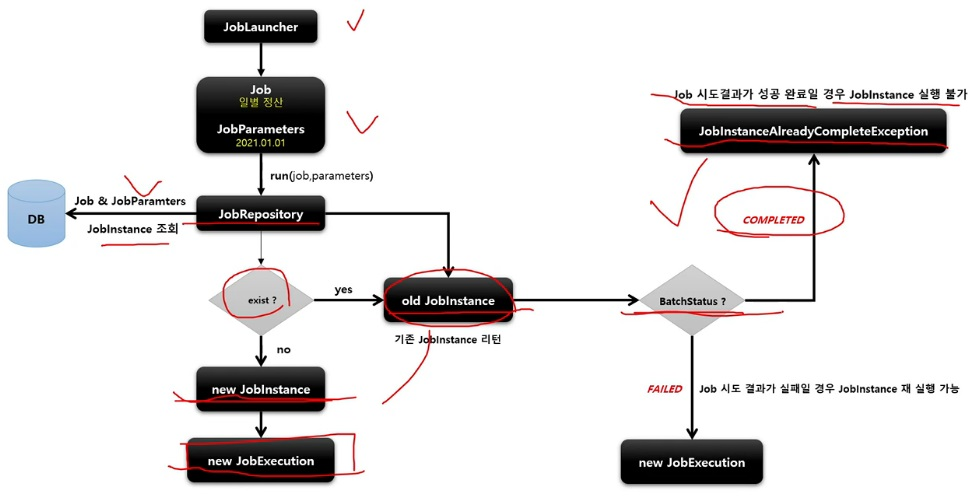

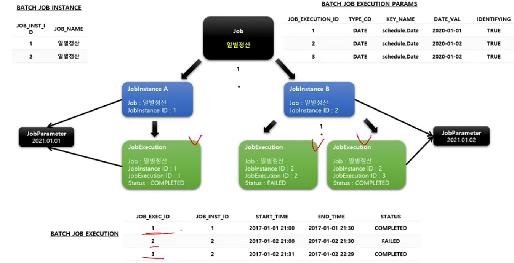

## Step

Batch Job 을 구성하는 독립적인 하나의 단계로서 실제 배치 처리를 정의하고 컨트롤하는데 필요한 모든 정보를 가지고 있는 도메인 객체
* 단순한 단일 태스크 뿐만 아니라 입력과 처리 그리고 출력과 관련된 복잡한 비즈니스 로직을 포함하는 모든 설정들을 담고 있음
* 배치 작업을 어떻게 구성하고 실행할 것인지 `Job` 의 세부 작업을 Task 기반으로 설정하고 명세해 놓은 객체
* 모든 `Job` 은 하나 이상의 `Step` 으로 구성됨

### 구현체

* TaskletStep
    + 가장 기본이 되는 클래스로서 `Tasklet` 타입의 구현체들을 제어
* PartitionStep
    + 멀티스레드 방식으로 `Step` 을 여러 개로 분리하여 실행
* JobStep
    + `Step` 내에서 `Job` 을 실행하도록 한다.
* FlowStep
    + `Step` 내에서 `Flow` 를 실행하도록 한다.

### Flow

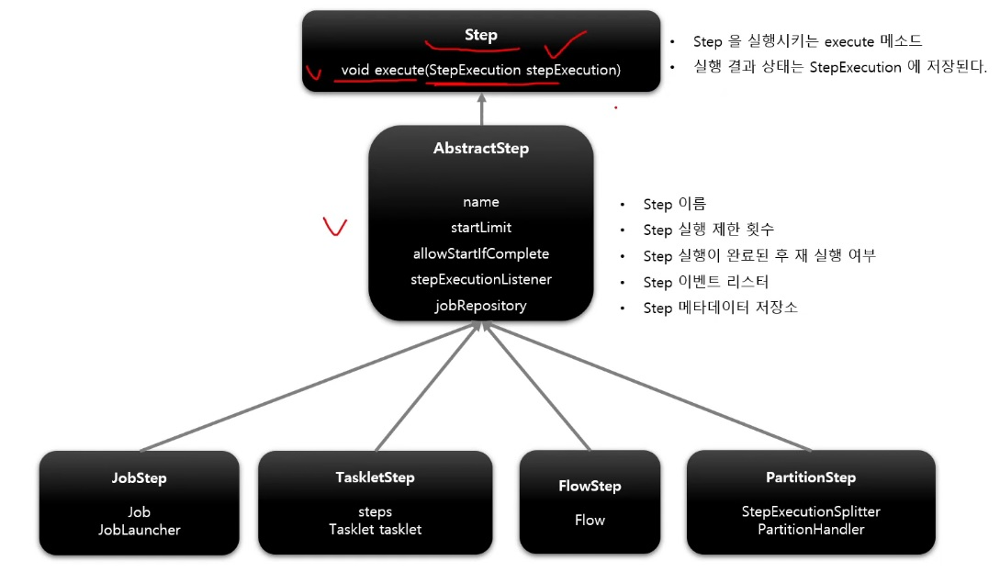

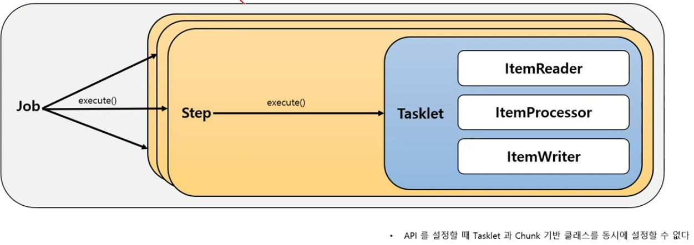

### 종류

```java
// Tasklet - 직접 생성한 Tasklet 실행
public Step taskletStep() {
    return this.stepBuilderFactory.get("step")
            .tasklet(myTasklet())
            .build();
}

// Tasklet - ChunkOrientedTasklet 을 실행
public Step taskletStepChunk() {
    return this.stepBuilderFactory.get("step")
            .<SomeObject, SomeObject>chunk(100)
            .build();
}

// Step 에서 Job 을 실행
public Step jobStep() {
    return this.stepBuilderFactory.get("step")
            .job(job())
            .launcher(jobLauncher)
            .parametersExtractor(jobParameterExtractor())
            .build();
}

// Step 에서 Flow 를 실행
public Step flowStep() {
    return this.stepBuilderFactory.get("step")
            .flow(myFlow())
            .build();
```

### StepExecution

`Step` 에 대하 한번의 시도를 의미하는 객체로서 `Step` 실행 중에 발생한 정보들을 저장하고 있는 객체

> 시작시간, 종료시간, 상태(시작됨, 완료, 실패), commit count, rollback count 등의 속성을 가짐

* `Step` 이 매번 시도될 때마다 생성되며 각 `Step` 별로 생성된다.
* `Job` 이 재시작하더라도 이미 성공적으로 완료된 `Step` 은 재실행되지 않고 실패한 `Step` 만 실행된다.
* 이전 단계 `Step` 이 실패해서 현재 `Step` 을 실행하지 않았다면 `StepExecution` 을 생성하지 않는다. `Step` 이 실제로 시작됐을 때만 `StepExecution` 을 생성한다.

> Step1, Step2, Step3 중에서 Step1 은 성공하고 Step2 에서 실패하였다면 Step3 에서는 `StepExecution` 을 생성하지 않는다.

* `JobExecution` 과의 관계
    + `Step` 의 `StepExecution` 이 모두 정상적으로 완료되어야 `JobExecution` 이 정상적으로 완료된다.
    + `Step` 의 `StepExecution` 중 하나라도 실패하면 `JobExecution` 은 실패한다.
        + 재시작을 할 때 이미 완료된 `Step` 은 건너뛴다. (ex. Step1, Step2, Step3 중에 Step1 성공, Step2 실패되었을 때 다시 시작하면 Step2 부터 진행된다.)

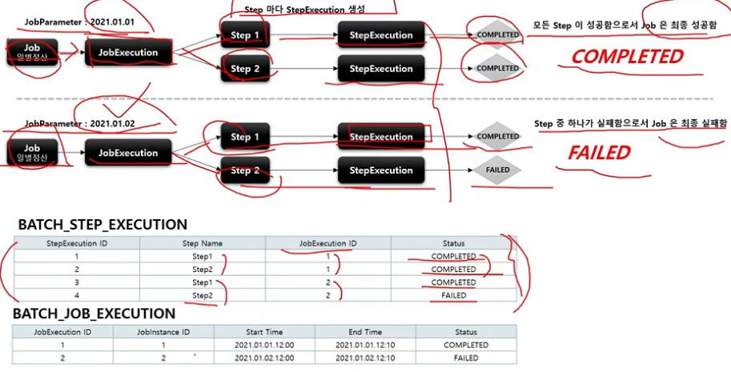

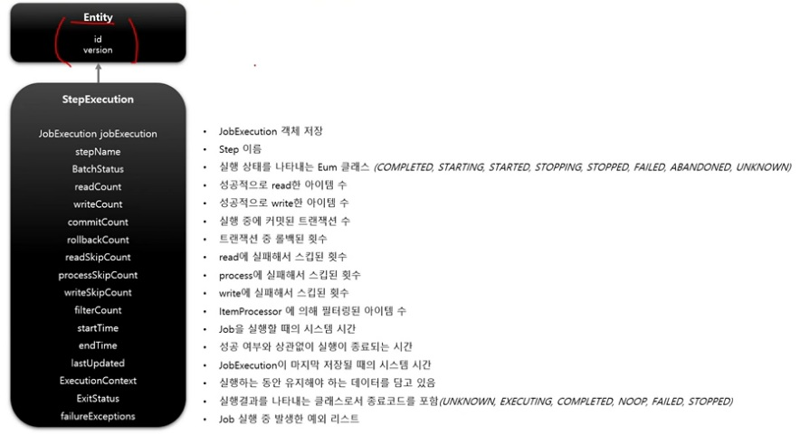

#### `BATCH_STEP_EXECUTION` 테이블과 매핑

* `JobExecution` 과 `StepExecution` 는 1:M 의 관계
* 하나의 `Job` 에 여러 개의 `Step` 으로 구성했을 경우, 각 `StepExecution` 은 하나의 `JobExecution` 을 부모로 가진다.

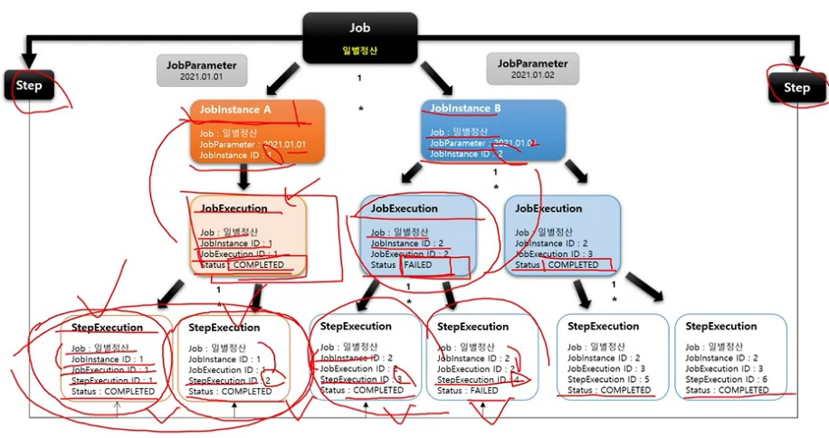

### StepContribution

청크 프로세스의 변경 사항을 버퍼링 한 후 `StepExecution` 상태를 업데이트하는 도메인 객체

> 우리가 사용하는 `Tasklet` 도 하나의 큰 청크 프로세스에서 실행된다.

* 청크 Commit 직전에 `StepExecution` 의 `apply` 메서드를 호출하여 상태를 업데이트 함
* `ExitStatus` 의 기본 종료코드 외 사용자 정의 종료코드를 생성해서 적용할 수 있음

#### Flow

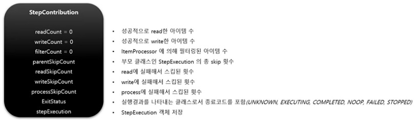

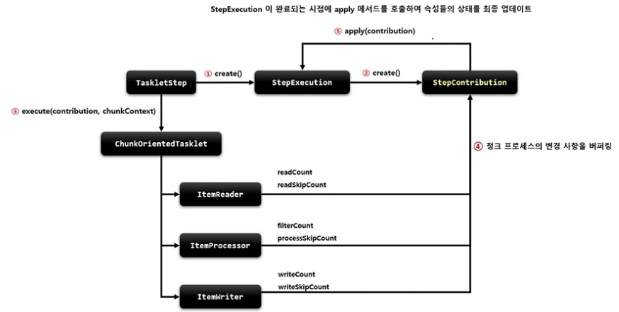

## ExecutionContext

프레임워크에서 유지 및 관리하는 키/값으로 된 컬렉션(Map)으로 `StepExecution` 또는 `JobExecution` 객체의 상태(state) 를 저장하는 공유 객체

* DB 에 직렬화 한 값으로 저장됨
    + {"key": "value"}
* 공유 범위
    + `Step` 범위 - 각 `Step` 의 `StepExecution` 에 저장되며 `Step` 간 서로 공유 안됨
    + `Job` 범위 - 각 `Job` 의 `JobExecution` 에 저장되며 `Job` 간 서로 공유 안되며 해당 `Job` 의 `Step` 간 서로 공유됨
* `Job` 재시작시 이미 처리한 Row 데이터는 건너뛰고 이후로 수행하도록 할 때 상태 정보를 활용한다.

### 구조


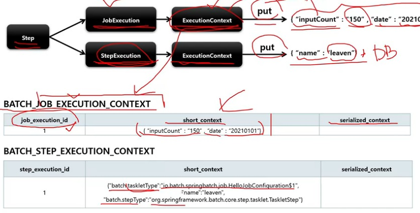

## JobRepository

배치 작업 중의 정보를 저장하는 저장소 역할

Job 이 언제 수행되었고, 언제 끝났으며, 몇 번이 실행되었고 실행에 대한 결과 등의 배치 작업의 수행과 관련된 모든 meta data 를 저장한다.

> JobLauncher, Job, Stepo 구현체 내부에서 CRUD 기능을 처리한다.

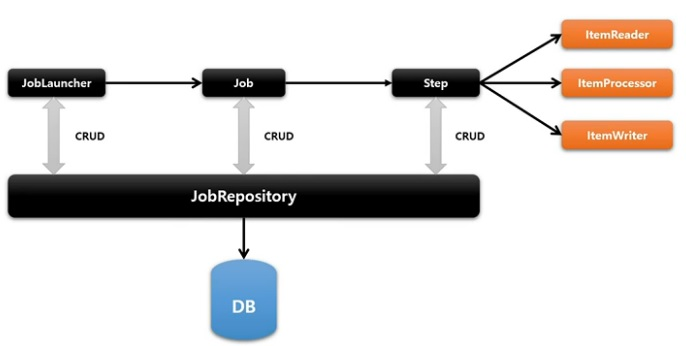

### 설정

`@EnableBatchProcessing` Annotation 만 선언하면 `JobRepository` 가 자동으로 Bean 으로 생성된다.

BatchConfigurer 인터페이스를 구현하거나 BasicBatchConfigurer 를 상속해서 `JobRepository` 설정을 커스터마이징을 할 수 있다.

* JDBC 방식으로 설정 - JobRepositoryFactoryBean
    + 내부적으로 AOP 기술을 통해 트랜잭션 처리를 해주고 있음
    + 트랜잭션 isolation 의 기본값은 SERIALIZEBLE 로 최고 수준. 다른 레벨로 지정 가능
    + 메타테이블의 Table Prefix 로 변경할 수 있음. 기본값은 BATCH_ 임
* In-Memory 방식으로 설정 - MapJobRepositoryFactoryBean
    + 성능 등의 이유로 도메인 오브젝트를 굳이 데이터베이스에 저장하고 싶지 않을 경우
    + 보통 Test 나 프로토타입의 빠른 개발이 필요할 때 사용

## JobLauncher

Batch Job 을 실행시키는 역할을 한다.

Job 과 Job Parameters 를 인자로 받으며, 요청된 배치 작업을 수행한 후 최종 client 에게 JobExecution 을 반환함

Spring Boot Batch 가 구동이 되면 `JobLauncher` 빈이 자동 생성된다.

* Job 실행
    + JobLauncher.run(Job, JobParameters)
    + Spring Boot Batch 에서는 JobLauncherApplicationRunner 가 자동적으로 JobLauncher 를 실행시킨다
    + 동기적 실행
        + taskExecutor 를 SyncTaskExecutor 로 설정할 경우 (기본값은 SyncTaskExecutor)
        + JobExecution 을 획득하고, 배치 처리를 최종 완료한 이후 Client 에게 JobExecution 을 반환
        + 스케줄러에 의한 배치 처리에 적합함 - 배치 처리 시간이 길어도 상관없을 경우
    + 비동기적 실행
        + taskExecutor 가 SimpleAsyncTaskExecutor 로 설정할 경우
        + JobExecution 을 획득한 후 Client 에게 바로 JobExecution 을 반환하고 배치 처리를 완료한다.
        + HTTP 요청에 의한 배치 처리에 적합함 - 배치 처리 시간이 길 경우, 응답이 늦어지지 않도록 함

