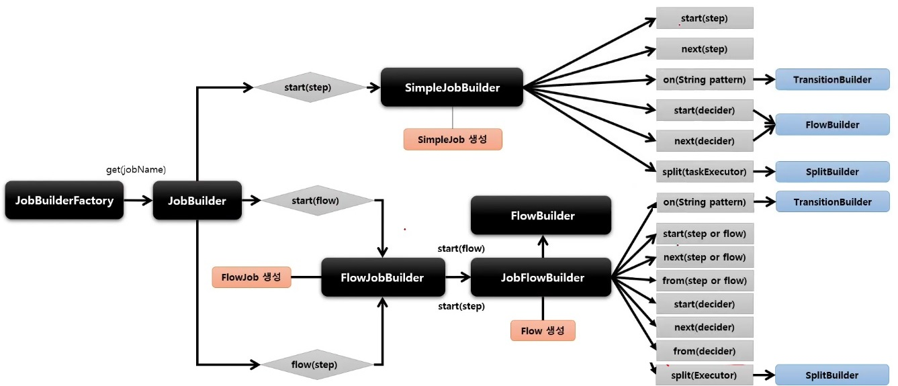
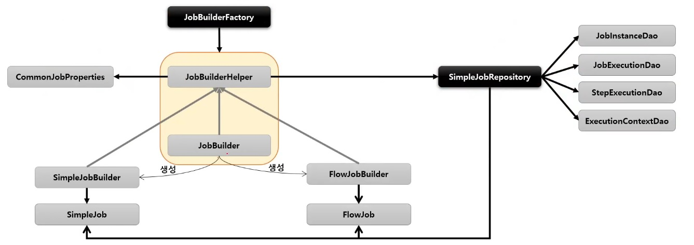

# JobBuilderFactory

Spring Batch 는 `Job` 과 `Step` 을 쉽게 생성 및 설정할 수 있도록 util 성격의 Builder 클래스들을 제공함

## JobBuilderFactory

`JobBuilder` 를 생성하는 Factory 클래스로서 get(String name) 메서드 제공

```java
// jobName 은 Spring Batch 가 Job 을 실행시킬 때 참조하는 Job 의 이름
jobBuilderFactory.get("jobName")
```

## JobBuilder

`Job` 을 구성하는 설정 조건에 따라 두 개의 하위 Builder 클래스를 생성하고 실제 `Job` 생성을 위임한다.

### SimpleJobBuilder

`SimpleJob` 을 생성하는 Builder 클래스. `Job` 실행과 관련된 여러 설정 API 를 제공한다.

### FlowJobBuilder

`FlowJob` 을 생성하는 Builder 클래스. 내부적으로 `FlowBuilder` 를 반환함으로써 Flow 실행과 관련된 여러 설정 API 를 제공한다.

## 구조



## 클래스 상속 구조



`JobBuilder` 가 생성되는 클래스 간의 계층 및 구조를 명확하게 이해하면 Job Configuration 을 구성할 때 많은 도움이 된다.

`JobRepository` 는 Builder 클래스를 통해 `Job` 객체에 전달되어 메타 데이터를 기록하는데 사용된다.