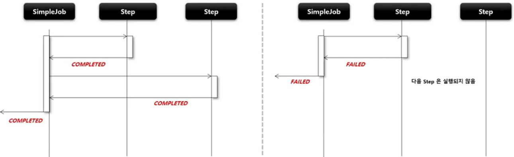

# SimpleJob

`Step` 을 실행시키는 `Job` 구현체로서 `SimpleJobBuilder` 에 의해 생성된다.

여러 단계의 `Step` 으로 구성할 수 있고, `Step` 을 순차적으로 실행시킨다.

모든 `Step` 의 실행이 성공적으로 완료되어야 `Job` 이 성공적으로 완료된다.

맨 마지막에 실행한 `Step` 의 `BatchStatus` 가 `Job` 의 최종 `BatchStatus` 가 된다.



```java
public Job batchJob() {
    return jobBuilderFactory
        // JobBuilder 를 생성하는 팩토리, Job 의 이름을 매개변수로 받음
        .get("batchJob")
        // 처음 실행할 Step 설정, 최초 한 번 설정, 이 메서드를 실행하면 SimpleJobBuilder 반환
        .start(step)
        // 다음에 실행할 Step 설정, 횟수는 제한이 없으며 모든 next() 의 Step 이 종료가 되면 Job 이 종료됨
        .next(step)
        // JobParameter 의 값을 자동으로 증가해주는 JobParameterIncrementer 설정
        .incrementer(jobParametersIncrementer)
        // Job 의 재시작 가능 여부 설정, 기본값은 true
        .preventRestart(true)
        // JobParameter 를 실행하기 전에 올바른 구성이 되었는지 검증하는 JobParametersValidator 설정
        .validator(jobParameterValidator)
        // Job Lifecycle 의 특정 시점에 Callback 을 제공받도록 JobExecutionListner 설정
        .listener(jobExecutionListener)
        // SimpleJob 생성
        .build(); 
}
```