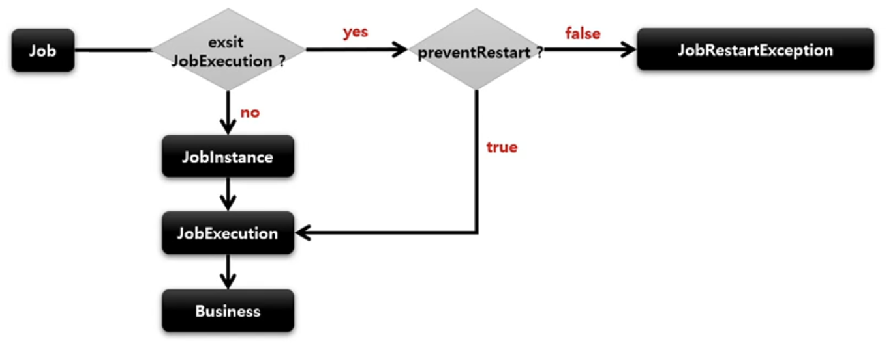

# SimpleJob - preventRestart

`Job` 의 재시작 여부를 설정

기본값은 true 이며 false 설정 시 *"이 Job 은 재시작을 지원하지 않는다"* 라는 의미. `Job` 의 성공/실패와 상관없이 오직 `preventRestart` 설정값에 따라 실행 여부를 판단한다.
> Job 이 실패해도 재시작이 안되며, Job 을 재시작하려고 하면 `JobRestartException` 이 발생한다.

> 재시작과 관련있는 기능으로 `Job` 을 처음 실행하는 것과는 아무런 상관이 없음



```java
public Job batchJob() {
    return jobBuilderFactory.get("batchJob")
        //.start(step)
        //.next(step)
        //.incrementer()
        //.validator()
        .preventRestart(restartable = false) // AbstractJob 에는 restartable 이 기본적으로 true 
        //.listener()
        .build();
}
```