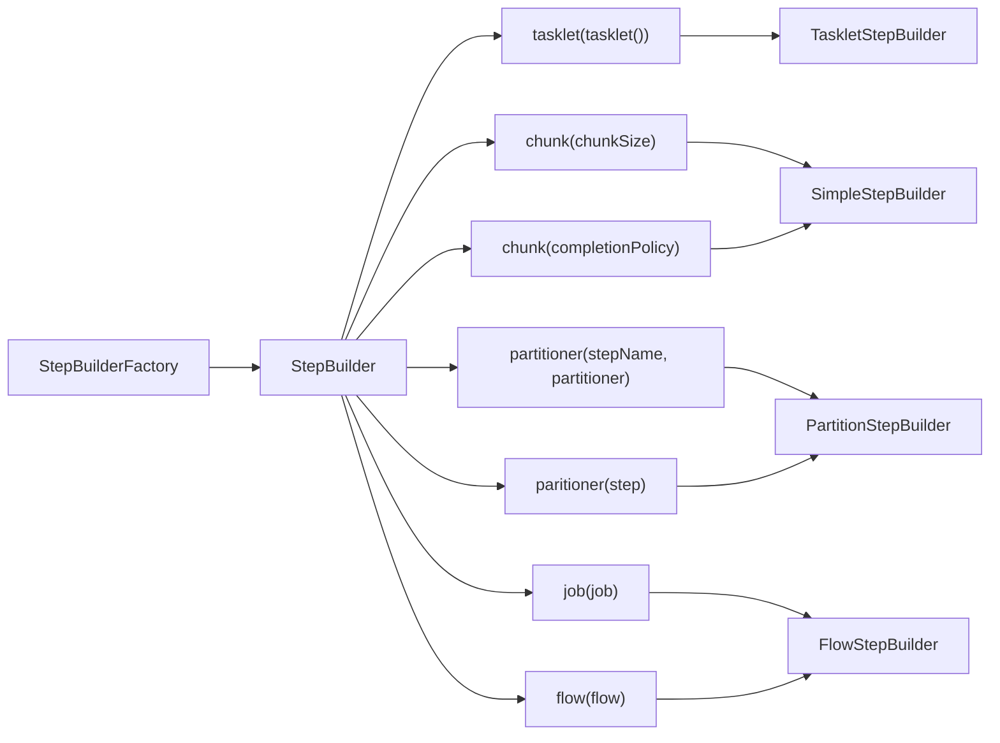

# Step - StepBuilderFactory / StepBuilder

## StepBuilderFactory

`StepBuilder` 를 생성하는 팩토리 클래스로서 **get(String name)** 메서드 제공

`StepBuilderFactory.get('stepName')` - 'stepName' 으로 Step 생성

## StepBuilder

`Step` 을 구성하는 설정 조건에 따라 다섯 개의 하위 Builder 클래스를 생성하고 실제 `Step` 생성을 위임한다.

* TaskletStepBuilder - `TaskletStep` 을 생성하는 기본 빌더 클래스
* SimpleStepBuilder - `TaskletStep` 을 생성하며 내부적으로 청크 기반의 작업을 처리하는 `ChunkOrientedTasklet` 클래스를 생성한다.
* PartitionStepBuilder - `PartitionStep` 을 생성하며 멀티스레드 방식으로 `Job` 을 실행한다.
* JobStepBuilder - `JobStep` 을 생성하며 `Step` 안에서 `Job` 을 실행한다.
* FlowStepBuilder - `FlowStep` 을 생성하며 `Step` 안에서 `Flow` 를 실행한다.

API 의 파라미터 타입과 구분에 따라 적절한 하위 Builder 가 생성된다.

chunk 사용 시 내부적으로는 `TaskletStep` 을 사용한다.