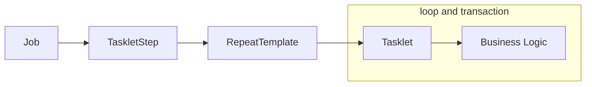
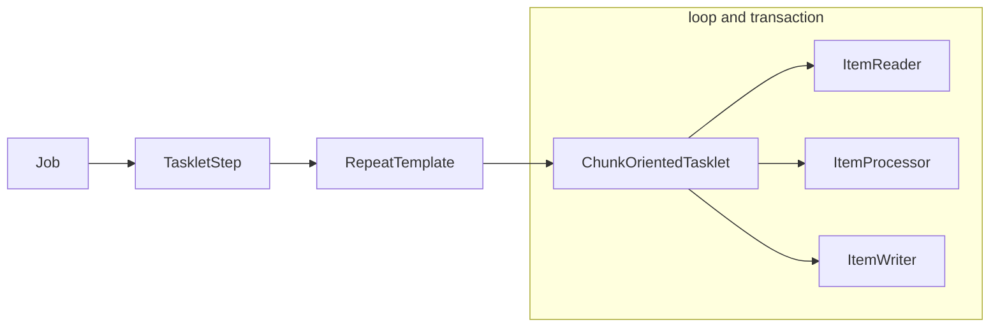

# TaskletStep - 개념 및 API 소개

Spring Batch 에서 제공하는 `Step` 의 구현체로서 `Tasklet` 을 실행시키는 도메인 객체

`RepeatTemplate` 를 사용해서 `Tasklet` 의 구문을 트랜잭션 경계 내에서 반복해서 실행함

> `TaskletStep` 이 `Tasklet` 을 실행시킬 때 `RepeatTemplate` 을 사용해서 반복 진행되도록 설정할 수 있음

> Spring Batch 에서 트랜잭션 제공

`Task` 기반과 `Chunk` 기반으로 나누어서 `Tasklet` 을 실행함

## Task vs Chunk 기반 비교

`Step` 의 실행 단위는 크게 두 가지로 나누어진다.

### Task

* `ItemReader` 와 `ItemWriter` 와 같은 Chunk 기반의 작업보다 **단일 작업** 기반으로 처리되는 것이 더 효율적인 경우
* 주로 `Tasklet` 구현체를 만들어서 사용
* 대량 처리를 하는 경우 chunk 기반에 비해 더 복잡한 구현 필요



### Chunk

* 하나의 큰 덩어리를 n개씩 나눠서 실행한다는 의미로 **대량 처리**를 하는 경우 효과적으로 설계됨
* `ItemReader`, `ItemProcessor`, `ItemWriter` 를 사용하며 Chunk 기반 전용 `Tasklet` 인 `ChunkOrientedTasklet` 구현체가 제공된다.



## API

주로 사용되는 API 만 소개함

```java
public Step batchStep() {
    return stepBuilderFactory.get("batchStep")
        .tasklet(Tasklet)
        // Step 의 실행 횟수를 설정. 설정한 만큼 실행되고 초과 시 오류 발생. 기본값은 INTEGER_MAX_VALUE
        .startLimit(10)
        // Step 의 성공/실패와 상관없이 항상 Step 을 실행하기 위한 설정
        .allowStartIfComplete(true)
        // Step 라이프사이클의 특정 시점에 콜백 제공받도록 StepExecutionListener 설정
        .listener(StepExecutionListener)
        // TaskletStep 을 생성
        .build();
}
```

### Task 기반으로 TaskletStep 생성

```java
public Step batchStep() {
    return stepBuilderFactory.get("batchStep")
        .tasklet(myTasklet())
        .build();
}
```

### Chunk 기반으로 TaskletStep 생성

```java
public Step batchStep() {
    return stepBuilderFactory.get("batchStep")
        .<String, String> chunk(100)
        .reader(new ListItemReader<>(Arrays.asList("item1", "item2")))
        .processor(new ItemProcessor<String, String>() {
            @Override
            public String process(String item) throws Exception {
                return item.toUpperCase();
            }
        })
        .writer(new ItemWriter<String>() {
            @Override
            public void write(List<? extends String> items) throws Exception {
                items.forEach(item -> System.out.println(item));
            }
        })
        .build();
}
```