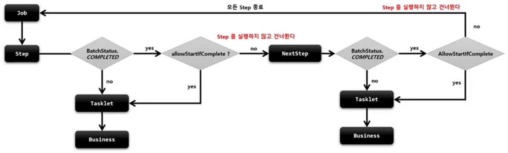

# TaskletStep - startLimit

`Step` 의 실행 횟수를 조정할 수 있다.

* `Step` 마다 설정할 수 있다.
* 설정 값을 초과해서 다시 실행하려고 하면 `StartLimitExceededException` 이 발생한다.
* start-limit 의 기본값은 Integer.MAX_VALUE

# allowStartIfComplete

재시작 가능한 `Job` 에서 `Step` 의 이전 성공 여부와 상관없이 항상 step 을 실행하기 위한 설정

* 실행마다 유효성을 검증하는 `Step` 이나 사전 작업이 꼭 필요한 `Step` 등
* 기본적으로 `COMPLETED` 상태를 가진 `Step` 은 `Job` 재시작 시 실행하지 않고 스킵한다.
* allow-start-if-complete 가 `true` 로 설정된 step 은 항상 실행한다.

