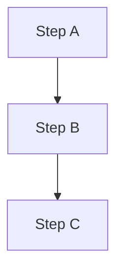
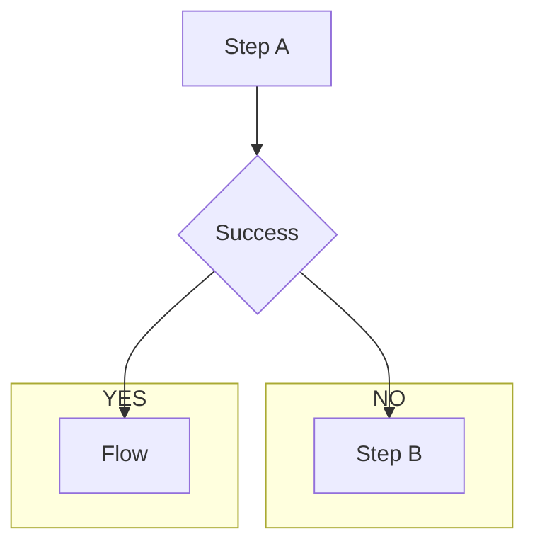

# 큰 주제

## 작은 주제

### 더 작은 주제

* ㅁㄴㅇㄻㄴㅇㄹ

1. ㅁㄴㅇㄹ
    + 데헷
2. ㅁㄴㅇㄹ
3. ㅁㄴㅇㄹ

# FlowJob

`Step` 을 순차적으로만 구성하는 것이 아닌 특정한 상태에 따라 흐름을 전환하도록 구성할 수 있으며 `FlowJobBuilder` 에 의해 생성된다.

* `Step` 이 실패하더라도 `Job` 은 실패로 끝나지 않도록 해야 하는 경우
* `Step` 이 성공했을 때 다음에 실행해야 할 `Step` 을 구분해서 실행해야 하는 경우
* 특정 `Step` 은 전혀 실행되지 않게 구성해야 하는 경우

`Flow` 와 `Job` 의 흐름을 구성하는데만 관여하고 실제 비즈니스 로직은 `Step` 에서 이루어진다.

내부적으로 `SimpleFlow` 객체를 포함하고 `Job` 실행 시 호출한다.

## SimpleJob vs FlowJob

### SimpleJob 

순차적 흐름

* Step A 가 먼저 실행
* Step A 가 실패하면 전체 `Job` 이 실패
* Step B 와 Step C 실행되지 않음

### FlowJob

조건적 흐름

* Step A 가 가장 먼저 실행
* Step A 가 성공하면 Flow 가 실행
* Step A 가 실패하면 Step B 가 실행
* 성공/실패 모두 `Job` 이 성공함

