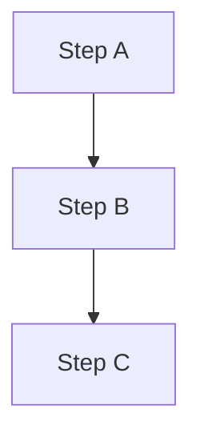
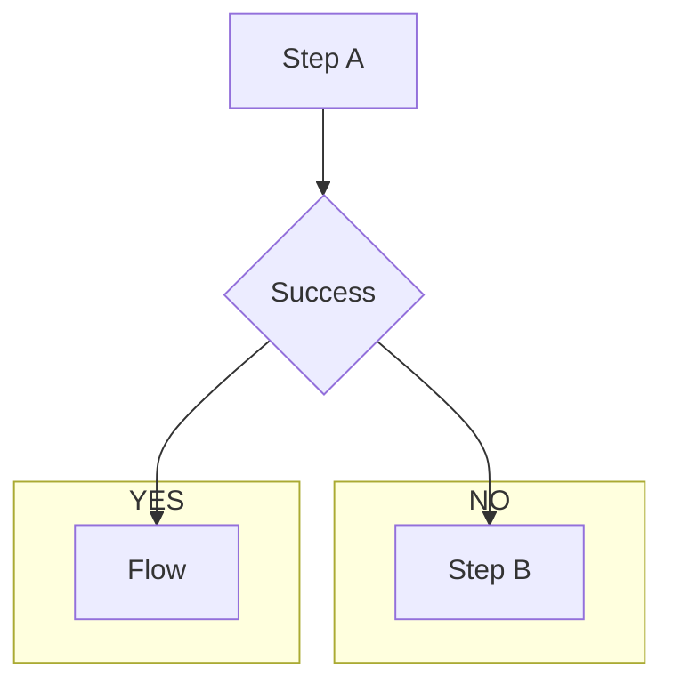
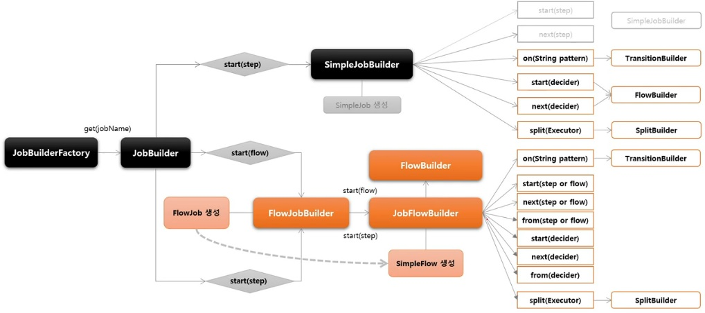
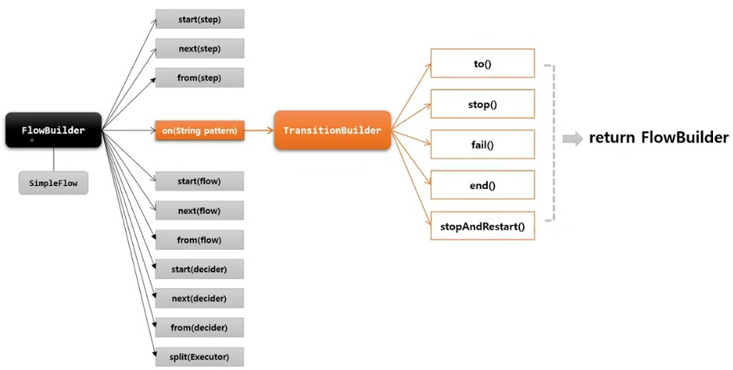

# 큰 주제

## 작은 주제

### 더 작은 주제

* ㅁㄴㅇㄻㄴㅇㄹ

1. ㅁㄴㅇㄹ
    + 데헷
2. ㅁㄴㅇㄹ
3. ㅁㄴㅇㄹ

# FlowJob

`Step` 을 순차적으로만 구성하는 것이 아닌 **특정한 상태에 따라 흐름을 전환하도록 구성**할 수 있으며 `FlowJobBuilder` 에 의해 생성된다.

* `Step` 이 실패하더라도 `Job` 은 실패로 끝나지 않도록 해야 하는 경우
* `Step` 이 성공했을 때 다음에 실행해야 할 `Step` 을 구분해서 실행해야 하는 경우
* 특정 `Step` 은 전혀 실행되지 않게 구성해야 하는 경우

`Flow` 와 `Job` 의 흐름을 구성하는데만 관여하고 실제 비즈니스 로직은 `Step` 에서 이루어진다.

내부적으로 `SimpleFlow` 객체를 포함하고 `Job` 실행 시 호출한다.

## SimpleJob vs FlowJob

### SimpleJob 

순차적 흐름

* Step A 가 먼저 실행
* Step A 가 실패하면 전체 `Job` 이 실패
* Step B 와 Step C 실행되지 않음



### FlowJob

조건적 흐름

* Step A 가 가장 먼저 실행
* Step A 가 성공하면 Flow 가 실행
* Step A 가 실패하면 Step B 가 실행
* 성공/실패 **모두 `Job` 이 성공**으로 취급함



## API

```java
public Job batchJob() {
    return jobBuilderFactory.get("batchJob")
        // Flow 시작하는 Step 설정
        .start(Step)
        // Step 의 실행 결과로 돌려받는 종료 상태 (ExitStatus) 를 catch 하여 매칭하는 패턴. TranstitionBuilder 반환
        .on(String pattern)
        // 다음으로 이동할 Step 지정
        .to(Step)
        // Flow 를 중지 / 실패 / 종료하도록 Flow 종료
        .stop() / fail() / end() / stopAndRestart()
        // 이전 단계에서 정의한 Step 의 Flow 를 추가적으로 정의함
        .from(Step)
        // 다음으로 이동할 Step 지정
        .next(Step)
        // build() 앞에 위치하면 FlowBuilder 를 종료하고 SimpleFlow 객체 생성
        .end()
        // FlowJob 을 생성하고 flow 필드에 SimpleFlow 저장
        .build();
}
```

start(), from(), next() -> 흐름을 정의하는 역할 (Flow)

on(), to(), stop()/fail()/... -> 조건에 따라 흐름을 전환시키는 역할 (Transition)

## 흐름도



단순한 `Step` 으로 생성하는 `SimpleJob` 보다 다양한 `Flow` 로 구성하는 `FlowJob` 의 생성 구조가 더 복잡하고 많은 API 를 제공한다.

`FlowBuilder` 는 `FlowJob` 에서 가장 중요한 역할을 한다.



## 예시

```java
@Configuration
@RequiredArgsConstructor
public class FlowJobConfiguration {
    private final JobBuilderFactory jobBuilderFactory;
    private final StepBuilderFactory stepBuilderFactory;

    @Bean
    public Job batchJob() {
        return jobBuilderFactory.get("batchJob")
                .start(helStep1())
                .on("COMPLETED").to(helStep3())
                .from(helStep1())
                .on("FAILED").to(helStep2())
                .end()
                .build();
    }

    @Bean
    public Step helStep1() {
        return stepBuilderFactory.get("helStep1")
                .tasklet(((contribution, chunkContext) -> {
                    System.out.println("Hello Spring Batch 1");
                    throw new RuntimeException("step1 was failed");
                }))
                .build();
    }

    @Bean
    public Step helStep2() {
        return stepBuilderFactory.get("helStep2")
                .tasklet(((contribution, chunkContext) -> {
                    System.out.println("Hello Spring Batch 2");
                    return RepeatStatus.FINISHED;
                }))
                .build();
    }

    @Bean
    public Step helStep3() {
        return stepBuilderFactory.get("helStep3")
                .tasklet(new CustomTasklet())
                .build();
    }
}
```