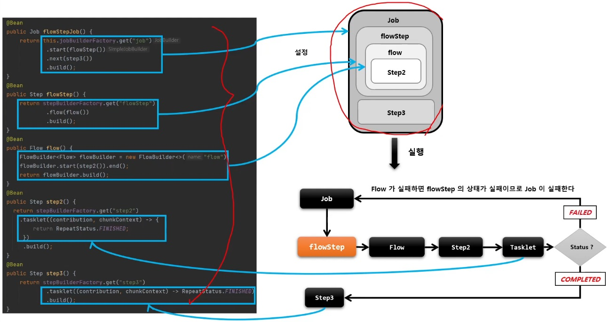

# FlowStep

`Step` 내에 `Flow` 를 할당하여 실행시키는 도메인 객체

flowStep 의 `BatchStatus` 와 `ExitStatus` 는 `Flow` 의 최종 상태값에 따라 결정된다.

## API

```java
public Step flowStep() {
    return stepBuilderFactory.get("flowStep")
        // Step 내에서 실행될 flow 설정, FlowStepBuilder 반환
        .flow(flow())
        // FlowStep 객체를 생성
        .build();
}
```

