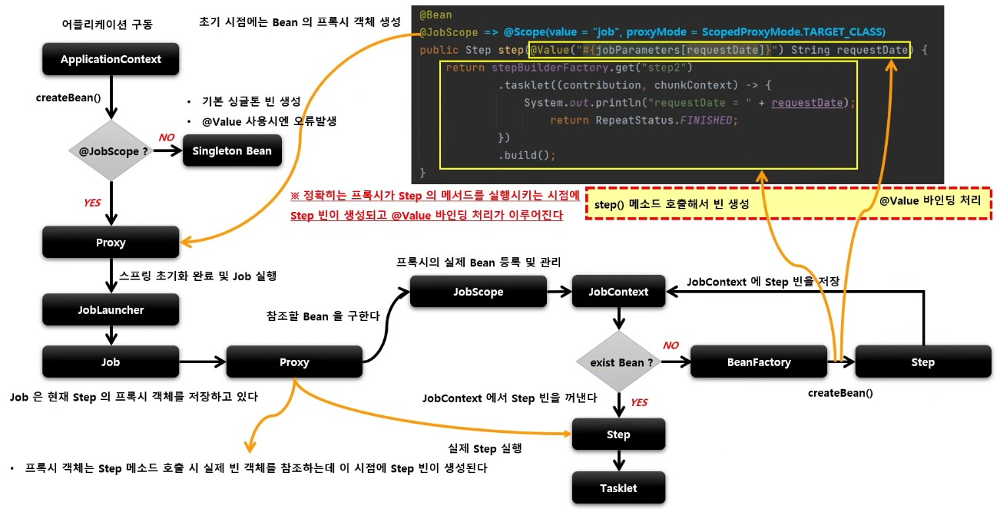

# JobScope, StepScope 아키텍처

전체적으로 보면 그냥 AOP 임

## Proxy 객체 생성

@JobScope, @StepScope 어노테이션이 붙은 빈 선언은 내부적으로 빈의 Proxy 객체가 생성된다.

Job 실행 시 Proxy 객체 실제 빈을 호출해서 해당 메서드를 실행시키는 구조

### JobScope

@Scope(value = "job", proxyMode = ScopedProxyMode.TARGET_CLASS)

### StepScope

@Scope(value = "step", proxyMode = ScopedProxyMode.TARGET_CLASS)

## JobScope, StepScope

Proxy 객체의 실제 대상이 되는 Bean 을 등록, 해제하는 역할

실제 빈을 저장하고 있는 JobContext, StepContext 를 가지고 있다.

## JobContext, StepContext

스프링 컨테이너에서 생성된 빈을 저장하ㅔ는 컨텍스트 역할

Job 의 실행 시점에서 프록시 객체가 실제 빈을 참조할 때 사용된다.

# 흐름

