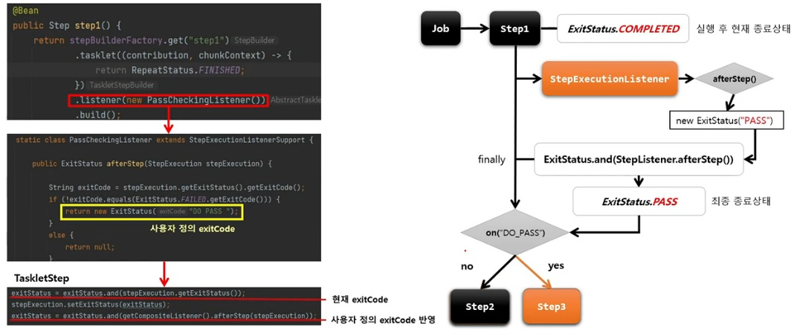

# 사용자 정의 ExitStatus

`ExitStatus` 에 존재하지 않는 exitCode 를 새롭게 정의하여 설정

`StepExecutionListener` 의 afterStep() 메서드에서 Custom exitCode 생성 후 새로운 `ExitStatus` 반환

`Step` 실행 후 완료 시점에서 현재 exitCode 를 사용자 정의 exitCode 로 수정할 수 있음

