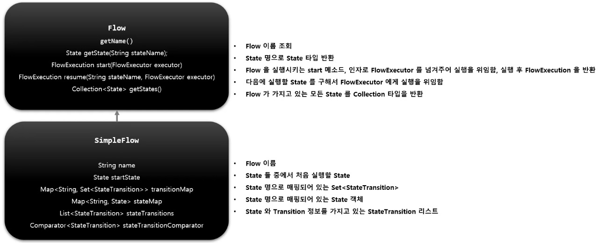

# SimpleFlow

Spring Batch 에서 제공하는 `Flow` 의 구현체로서 각 요소(`Step`, `Flow`, `JobExecutionDecider`) 들을 담고있는 State 를 실행시키는 도메인 객체

`FlowBuilder` 를 사용해서 생성하며 Transition 과 조합하며 여러 개의 Flow 및 중첩 Flow 를 만들어 Job 을 구성할 수 있다.



참고로 `Flow` 안에 `Step` 을 구성하거나 `Flow` 를 중첩되게 구성할 수 있다.

```java
public Job batchJob() {
    return jobBuilderFactory.get("flowJob")
        // Flow 를 정의하여 설정함
        .start(flow1())
        // Flow 를 Transition 과 함께 구성
        .on("COMPLETED").to(flow2())
        // SimpleFlow 객체 생성
        .end()
        .build();
}
```

