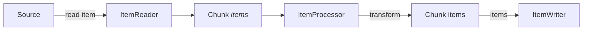
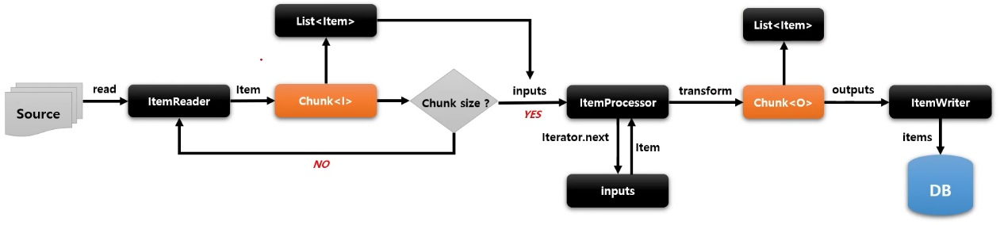
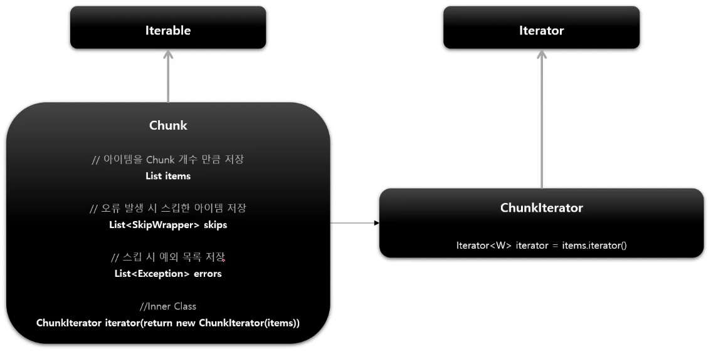

# Chunk

여러 개의 아이템을 묶은 하나의 덩어리, 블록을 의미

한 번에 하나씩 아이템을 입력받아 Chunk 단위의 덩어리로 만든 후 Chunk 단위로 트랜잭션을 처리한다. 즉, Chunk 단위의 Commit 과 Rollback 이 이루어진다.

일반적으로 대용량 데이터를 한 번에 처리하는 것이 아닌 Chunk 단위로 쪼개어서 더 이상 처리할 데이터가 없을 때까지 반복해서 입출력하는데 사용된다.

## Chunk\<I> vs Chunk\<O>

* `Chunk<I>` - `ItemReader` 로 읽은 하나의 아이템을 Chunk 에서 정한 개수만큼 반복해서 저장하는 타입
* `Chunk<O>` - `ItemReader` 로부터 전달받은 `Chunk<I>` 를 참조해서 `ItemProcessor` 에서 적절하게 가공, 필터링한 다음, `ItemWriter` 에 전달하는 타입



아래 그림은 Transaction 경계 내에서 이루어진다.

`ItemReader` 와 `ItemProcessor` 는 Chunk 내 개별 아이템을 처리한다.





`ChunkIterator` 는 `Chunk` 에 저장된 Item 을 추출하기 위함


```java
@Bean
public Job job() {
    return jobBuilderFactory.get("batchJob")
        .start(step1())
        .next(step2())
        .build();
}

@Bean
public Step step1() {
    return stepBuilderFactory.get("step1")
        .<String, String>chunk(5)
        .reader(new ListItemReader<>(Arrays.asList("item1", "item2", "item3", "item4", "item5")))
        .processor(new ItemProcessor<String, String>() {
            @Override
            public String process(String item) throws Exception {
                Thread.sleep(300);
                System.out.println("item = " + item);
                return "my" + item;
            }
        })
        .writer(new ItemWriter<String>() {
            @Override
            public void write(List<? extends String> items) throws Exception {
                Thread.sleep(300);
                System.out.println("items = " + items);
            }
        })
        .build();
}

...
```