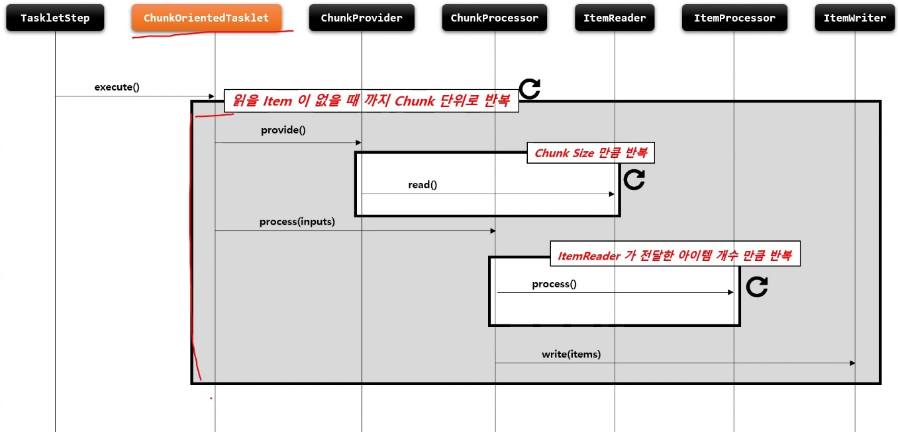
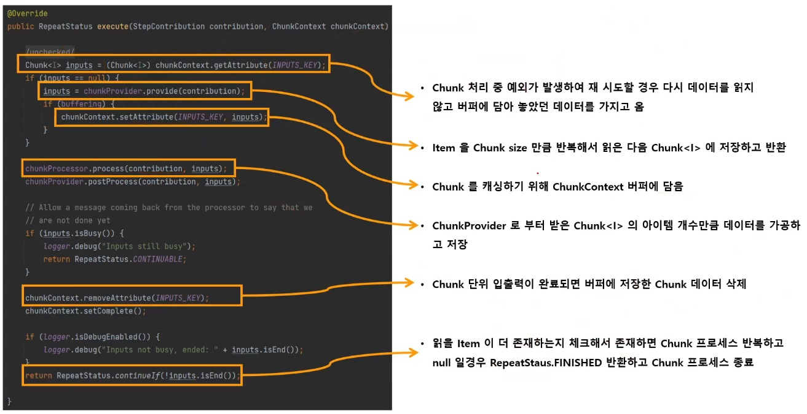

# ChunkOrientedTasklet

스프링 배치에서 제공하는 Tasklet 의 구현체로서 Chunk 지향 프로세싱을 담당하는 도메인 객체

`ItemReader`, `ItemWriter`, `ItemProcessor` 를 사용하여 Chunk 기반의 데이터 입출력 처리를 담당한다.

`TaskletStep` 에 의해서 반복적으로 실행되며, `ChunkOrientedTasklet` 이 실행될 때마다 매번 새로운 트랜잭션이 생성되어 처리가 이루어진다.

Exception 이 발생할 경우, 해당 Chunk 는 롤백되며 이전에 커밋한 Chunk 는 완료된 상태가 유지된다.

내부적으로 `ItemReader` 를 핸들링하는 `ChunkProvider` 와 `ItemProcessor`, `ItemWriter`  를 핸들링하는 `ChunkProcessor` 타입의 구현체를 가진다.

아래 흐름은 Transaction 경계 내에서 이루어진다.

write 는 Chunk 단위로 이루어진다.






```java
public Step chunkStep() {
    return stepBuilderFactory.get("chunkStep")
        // chunk size 설정. chunk size 는 commit interval 을 의미함. input, output 제네릭타입 설정
        .<I, O>chunk(10)
        // Chunk 프로세스를 완료하기 위한 정책 설정 클래스 지정
        .<I, O>chunk(CompletionPolicy)
        // 소스로부터 item 을 읽거나 가져오는 ItemReader 구현체 설정
        .reader(ItemReader())
        // item 을 목적지에 쓰거나 보내기 위한 ItemWriter 구현체 설정
        .writer(ItemWrtier())
        // item 을 변형, 가공, 필터링을 하기 위한 ItemProcessor 구현체 설정
        .processor(ItemProcessor())
        // 재시작 데이터를 관리하는 콜백에 대한 스트림 등록
        .stream(ItemStream())
        // item 이 JMS, Message Queue Server 와 같은 트랜잭션 외부에서 읽혀지고 캐시할 것인지 여부, 기본값은 false
        .readerIsTransactionalQueue()
        // chunk 프로세스가 진행되는 특정 시점에 콜백 제공받도록 ChunkListener 설정
        .listener(ChunkListener)
        .build();
}
```