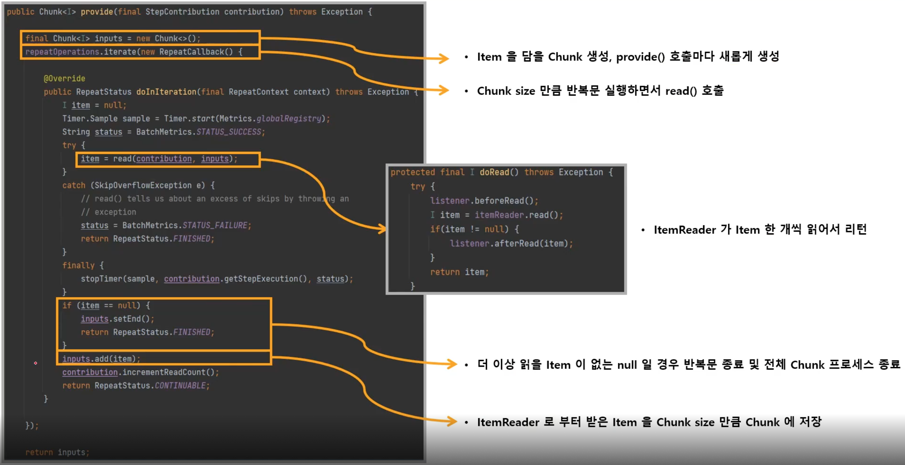
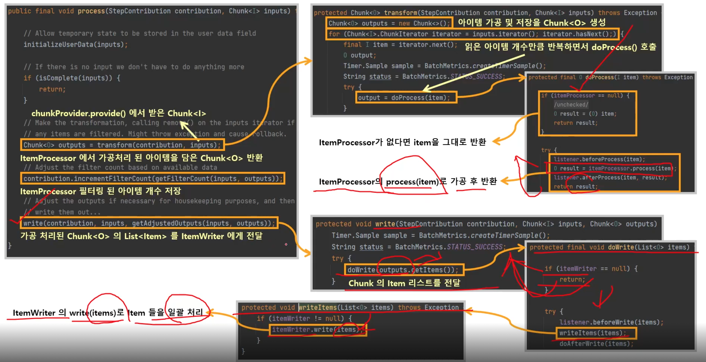

# ChunkProvider

ItemReader 를 사용해서 소스로부터 아이템 Chunk size 만큼 읽어 Chunk 단위로 만들어 제공하는 도메인 객체

Chunk<I> 를 만들고 내부적으로 반복문을 사용해서 ItemReaderRead() 를 계속 호출하며 Item 을 Chunk 에 넣는다.

외부로부터 ChunkProvider 가 호출될 때마다 항상 새로운 Chunk 가 생성된다.

반복문 종료 시점

* Chunk size 만큼 Item 을 읽으면 반목문이 종료되고 ChunkProcessor 로 넘어감
* ItemReader 가 읽은 Item 이 null 일 경우, 반복문 종료 및 해당 Step 반복문까지 종료

기본 구현체로서 SimpleChunkProvider 와 FaultTolerantChunkProvider (Skip, Retry 기능이 포함됨) 가 있다.

# ChunkProcessor

ItemProcessor 를 사용해서 Item 을 변형, 가공, 필터링을 하고, ItemWriter 를 사용해서 Chunk 데이터를 저장, 출력한다.

Chunk<O> 를 만들고, 앞에서 넘어온 Chunk<I> 의 Item 을 한 건씩 처리한 후 Chunk<O> 에 저장한다.

외부로부터 ChunkProcessor 가 호출될 때마다 항상 새로운 Chunk 가 생성된다.

ItemProcessor 는 설정 시 선택사항으로서 만약 객체가 존재하지 않을 경우, ItemReader 에서 읽은 Item 그대로가 Chunk<O> 에 저장된다.

ItemProcessor 처리가 완료되면 Chunk<O> 에 있는 List<Item> 을 ItemWriter 에 전달한다.

ItemWirter 처리가 완료되면, Chunk 트랜잭션이 종료하게 되고, Step 반복문에서 ChunkOrientedTasklet 가 새롭게 실행된다.

ItemWriter 는 Chunk 사이즈 만큼 데이터를 커밋 처리하기 때문에 Chunk 사이즈는 곧 Commit Interval 이 된다.

기본 구현체로서 SimpleChunkProcessor 와 FaultTolerantChunkProcessor 가 있다.

