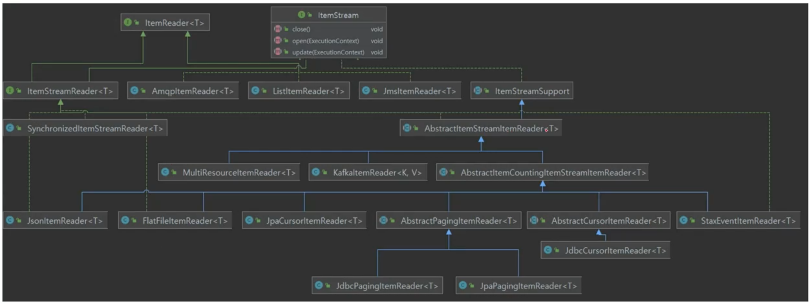
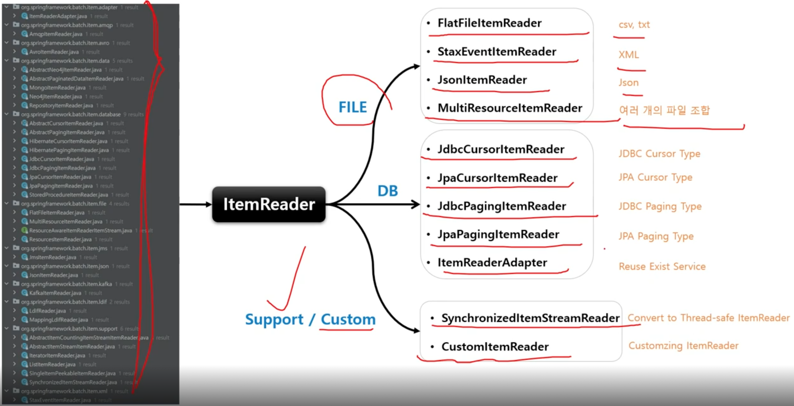
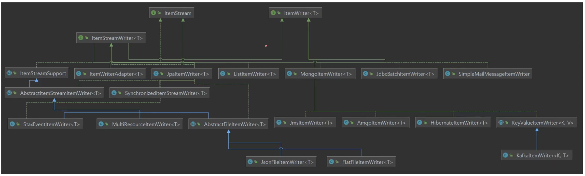
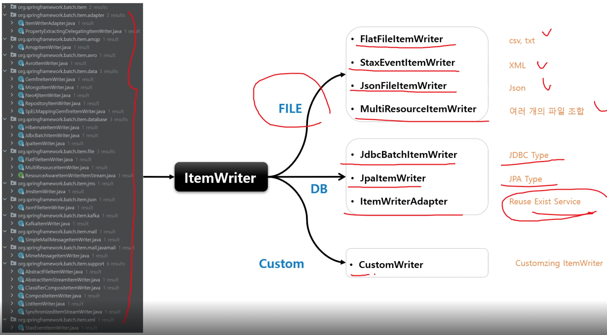
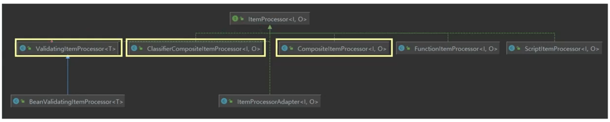
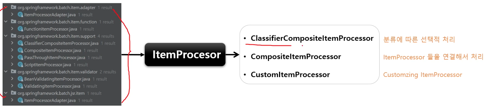

# ItemReader

다양한 입력으로부터 데이터를 읽어서 제공하는 인터페이스

* 플랫(Flat) 파일 - csv, txt
* XML, Json
* Database
* JMS, RabbitMQ 와 같은 메세지 큐 서비스
* Custom Reader - 구현 시 멀티 스레드 환경에서 스레드에 안전하게 구현할 필요가 있음

ChunkOrientedTasklet 실행 시 필수적 요소로 설정해야 한다.

## 구조

ItemReader<T>

T read()

* 입력 데이터를 읽고, 다음 데이터로 이동한다.
* 아이템 하나를 리턴하며, 더 이상 아이템이 없는 경우 null 반환
* 아이템 하나는 파일의 한줄, DB 의 한 row 혹은 XML 파일에서 하나의 엘리먼트가 될 수 있다.
* 더 이상 처리해야 할 Item 이 없어도 예외가 발생하지 않고 ItemProcessor 와 같은 다음 단계로 넘어간다.

다수의 구현체들이 ItemReader 와 ItemStream 인터페이스를 동시에 구현하고 있음

* 파일의 스트림을 열거나 종료, DB 커넥션을 열거나 종료, 입력 장치 초기화 등의 작업
* ExecutionContext 에 read 와 관련된 여러가지 상태 정보를 저장해서 재시작 시 다시 참조하도록 지원

# ItemWriter

Chunk 단위로 데이터를 받아 일괄 출력 작업을 위한 인터페이스

* 플랫(Flat) 파일 - csv, txt
* XML, Json
* Database
* JMS, RabbitMQ 와 같은 메세지 큐 서비스
* Mail Service
* Custom Reader - 구현 시 멀티 스레드 환경에서 스레드에 안전하게 구현할 필요가 있음

아이템 하나가 아닌 아이템 리스트를 전달받는다.

ChunkOrientedTasklet 실행 시 필수적 요소로 설정해야 한다.

## 구조

ItemWriter<T>

void write(List<? extends T> items) throws Exception

* 출력 데이터를 아이템 리스트로 받아 처리한다.
* 출력이 완료되고 트랜잭션이 종료되면 새로운 Chunk 단위 프로세스로 이동한다.

다수의 구현체들의 ItemWriter 와 ItemStream 을 동시에 구현하고 있다.
* 파일의 스트림을 열거나 종료, DB 커넥션을 열거나 종료, 출력 장치 초기화 등의 작업

보통 ItemReader 구현체와 1:1 대응 관계인 구현체들로 구성되어 있다.

# ItemProcessor

데이터를 출력하기 전에 데이터를 가공, 변형, 필터링하는 역할

ItemReader 및 ItemWriter 와 분리되어 비즈니스 로직을 구현할 수 있다.

ItemReader 로부터 받은 아이템을 특정 타입으로 변환하여 ItemWriter 에 넘겨줄 수 있다.

ItemReader 로부터 받은 이이템들 중 필터 과정을 거쳐 원하는 아이템만 ItemWriter 에게 넘겨줄 수 있다.
* ItemProcessor 에서 process() 실행 결과 null 을 반환하면 Chunk<O> 에 저장되지 않기 때문에 결국 ItemWriter 에게 전달되지 않는다.

ChunkOrientedTasklet 실행 히 선택적 요소이기 때문에 청크 기반 프로세싱에서 ItemProcessor 단계가 반드시 필요한 것은 아니다.

## 구조

ItemProcessor<I, O>

O Process
* I 제네릭은 ItemReader 에서 받을 데이터 타입 지정
* O 제네릭은 ItemWriter 로 보낼 데이터 타입 지정
* 아이템 하나씩 가공 처리하며 null 리턴할 경우 해당 아이템은 Chunk<O> 에 저장되지 않음

* ItemStream 을 구현하지 않는다.
* 거의 대부분 Customizing 해서 사용하기 때문에 기본적으로 제공되는 구현체가 적다.

