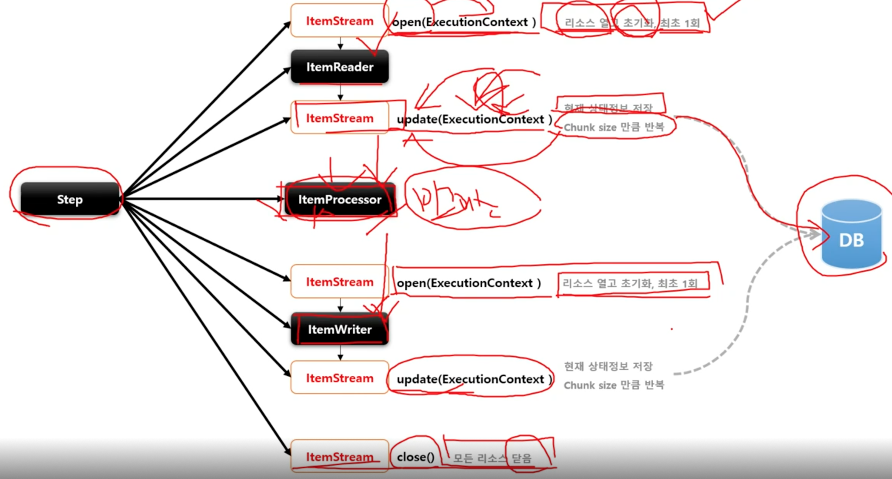

# ItemStream

ItemReader 와 ItemWriter 처리 과정 중 상태를 저장하고 오류가 발생하면 해당 상태를 참조하여 실패한 곳에서 재시작하도록 지원

* 리소스를 열고(open) 닫아야(close) 하며, 입출력 장치 초기화 등의 작업을 해야 하는 경우
* ExecutionContext 를 매개변수로 받아서 상태 정보를 업데이트(update) 한다.
* ItemReader 및 ItemWriter 는 ItemStream 을 구현해야 한다.

## 구조

```
ItemStream

// read, write 메서드 호출 전에 파일이나 커넥션이 필요한 리소스에 접근하도록 초기화 작업
void open(ExecutionContext executionContext) throws ItemStreamException
// 현재까지 진행된 모든 상태를 저장
void update(ExecutionContext executionContext) throws ItemStreamException
// 열려있는 모든 리소스를 안전하게 해제하고 닫음
void close() throws ItemStreamException
```

