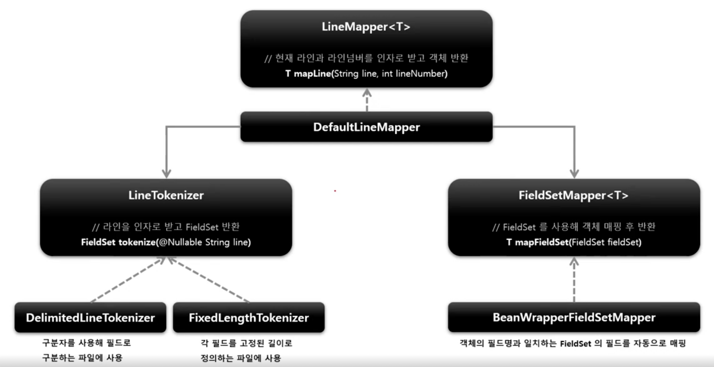
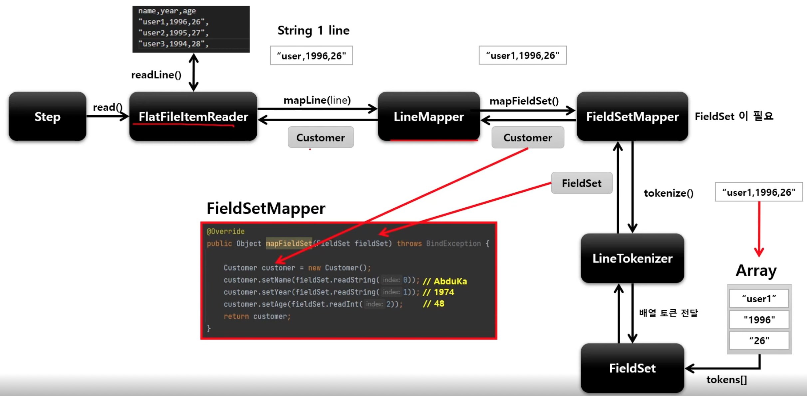
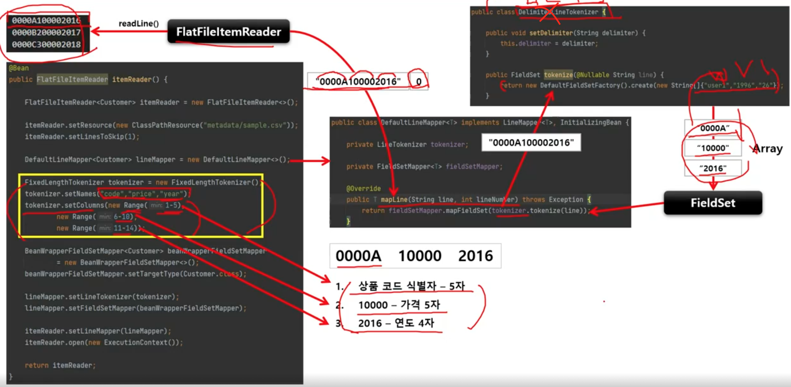

# FlatFileItemReader

2차원 데이터(표)로 표현된 유형의 파일을 처리하는 ItemReader

이반적으로 고정 위치로 정의된 데이터 필드나 특수 문자에 의해 구별된 데이터의 행을 읽는다.

Resource 와 LineMapper 두 가지 요소가 필요하다

## 구조

FlatFileItemReader

```
// 문자열 인코딩, 디폴트는 Charset.defaultCharset()
String encoding = DEFAULT_CHARSET

// 파일 상단에 있는 무시할 라인수
int linesToSkip

// 해당 코멘트 기호가 있는 라인은 무시한다.
String[] comments

// 읽어야 할 리소스
Resource resource

// String 을 Object 로 변환한다.
LineMapper<T> lineMapper

// 건너뛸 라인의 원래 내용을 전달하는 인터페이스
// linesToSkip 이 2이면 두 번 호출된다.
LineCallbackHandler skippedLinesCallback
```

**Resource**

* FileSystemResource - new FileSystemResource("resource/path/config.yml")
* ClassPathResource - new ClassPathResource("classpath:path/config.yml")

**LineMapper**

파일의 라인 한 줄을 Object 로 변환해서 FlatFileReader 로 반환한다.

단순히 문자열을 받기 때문에 문자열을 토큰화해서 객체로 매핑하는 과정이 필요하다

`LineTokenizer` 와 `FieldSetMapper` 를 사용해서 처리한다.

* FieldSet
    + 라인을 필드로 구분해서 만든 배열 토큰을 전달하면 토큰 필드를 참조할 수 있도록 한다.
    + JDBC 의 `ResultSet` 과 유사하다 (ex. fs.readString(0), fs.readString("name"))
* LineTokenizer
    + 입력받은 라인을 `FieldSet` 으로 변환해서 반환한다.
    + 파일마다 형식이 다르기 때문에 문자열을 FieldSet 으로 변환하는 작업을 추상화시켜야 한다.
* FieldSetMapper
    + `FieldSet` 객체를 받아서 원하는 객체로 매핑해서 반환한다.
    + `JdbcTemplate` 의 `RowMapper` 와 동일한 패턴을 사용한다.



```java
return new FlatFileItemReaderBuilder<T>()
    // 이름 설정. ExecutionContext 내에서 구분하기 위한 Key 저장
    .name(String name)
    // 읽어야 할 리소스 설정
    .resource(Resource)
    // 파일의 구분자를 기준으로 파일을 읽어들이는 설정
    .delimited().delimiter("|")
    // 파일의 고정 길이를 기준으로 파일을 읽어들이는 설정
    .fixedLength()
    // 고정길이 범위를 정하는 설정
    .addColumns(Range...)
    // LineTokenizer 로 구분된 라인의 항목을 객체의 필드명과 매핑하도록 설정
    .names(String[] fileNames)
    // 라인의 각 항목과 매핑할 객체 타입 설정
    .targetType(Class class)
    // 무시할 라인의 코멘트 기호 설정
    .addComment(String comment)
    // 라인을 읽거나 토큰화할 때 Parsing 예외가 발생하지 않도록 검증 생략하도록 설정
    .strict(boolean)
    // 파일 인코딩 설정
    .encoding(String encoding)
    // 파일 상단에 있는 무시할 라인 수 설정
    .linesToSkip(int linesToSkip)
    // 상태 정보를 저장할 것인지 설정
    .saveState(boolean)
    // LineMapper 객체 설정
    .setLineMapper(LineMapper)
    // FieldSetMapper 객체 설정
    .setFieldSetMapper(FieldSetMapper)
    // LineTokenizer 객체 설정
    .setLineTokenizer(LineTokenizer)
    .build();
```

## DelimitedLineTokenizer

한 개 라인의 String 을 구분자 기준으로 나누어 토큰화하는 방식

```
AbstractLineTokenizer

// FieldSet 에서 인덱스가 아닌 필드맵으로 객체와 매핑할 수 있도록 함
String[] names

// 토큰화 검증을 적용할 것인지 여부. 기본값은 true
boolean strict = true

// Fieldset 생성 팩토리 객체
FieldSetFactory fieldSetFactory

```

```
DelimitedLineTokenizer
AbstractLineTokenizer 을 상속받음

// 구분자. 기본값은 콤마(,)
String delimiter

// String line 을 토큰화해서 FieldSet 에게 넘겨주고 반환
FieldSet tokenize(@Nullable String line)
```



## FixedLengthTokenizer

한 개 라인의 String 을 사용자가 설정한 고정 길이 기준으로 나누어 토큰화하는 방식

범위는 문자열 형식으로 설정할 수 있다.
* "1~4" Ehsms "1~3,4~6,7" 또는 "1~2,4~5,7~10"
* 마지막 범위가 열려있으면 나머지 행이 해당 열로 읽혀진다.

```
FixedLengthTokenizer

// 열의 범위를 설정
Range[] ranges

// 최대 범위 설정
int maxRange = 0

// 마지막 범위가 열려 있는지 여부
Boolean open = false
```



## Exception Handling

라인을 읽거나 토큰화할 때 발생하는 Parsing 예외를 처리할 수 있도록 예외 계층 제공

토큰화 검증을 엄격하게 적용하지 않도록 설정하면 Parsing 예외가 발생하지 않도록 할 수 있다.

* ItemReaderException - FlatFileParseException
    + ItemReader 에서 파일을 읽어들이는 동안 발생하는 예외

* FlatFileFormatException
    + LineTokenizer 에서 토큰화하는 도중 발생하는 예외
    + FlatFileException 보다 좀 더 구체적인 예외
* IncorrectTokenCountException
    + DelimitedLineTokenizer 로 토큰화할 때 컬럼 개수와 실제 토큰화한 컬럼 수와 다를 때 발생하는 예외
* IncorrectLineLengthException
    + FixedLengthLineTokenizer 으로 토큰화할 때 라인 전체 길이와 컬럼 길이의 총합과 일치하지 않을 때 발생

### 토큰화 검증 기준 설정

```java
1. tokenizer.setColumns(new Range[] { new Range(1,5), new Range(6, 10) }); // 토큰 길이 10자

2. tokenizer.setStrict(false); // 토큰화 검증을 적용하지 않음

3. FieldSet tokens = tokenizer.tokenize("12345"); // 라인 길이 5자
```

1. LineTokenizer 의 Strict 속성을 false 로 설정하게 되면 tokenizer 가 라인 길이를 검증하지 않는다.
2. Tokenizer 가 라인 길이나 컬럼명을 검증하지 않을 경우 예외가 발생하지 않는다.
3. FieldSet 은 성공적으로 리턴이 되며, 두 번째 범위값은 빈 토큰을 가지게 된다.

