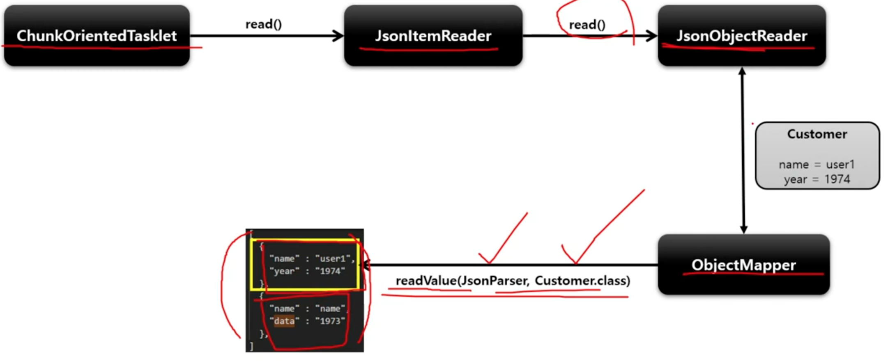

# JsonItemReader

Json 데이터의 Parsing 과 Binding 을 JsonObjectReader 인터페이스 구현체에 위임하여 처리하는 ItemReader

두 가지 구현체 제공
* JacksonJsonObjectReader
* GsonJsonObjectReader

## 구조

```
JacksonJsonObjectReader<T>

// Json 데이터를 매핑할 객체 타입
Class<? extends T> itemType

// Json 구문을 분석하는 파서기
JsonParser jsonParser

// Json 을 Object 로 매핑하는 매퍼
ObjectMapper mapper

// Json 파일로부터 읽는 입력 스트림
InputStream inputStream
```

```
JsonItemReader<T>
JacksonJsonObjectReader 을 상속

// 다양한 리소스에 접근하도록 추상화한 인터페이스
Resource resource

// Json 구문을 객체로 변환
JsonObjectReader jsonObjectReader
```



### API 설정

```java
@Bean
public JsonItemReader<Customer> jsonItemReader() {
    return new JsonItemReaderBuilder<Customer>()
        .jsonObjectReader(new JacksonJsonObjectReader<>(Customer.class))
        .resource(new ClassPathResource("/customer.json"))
        .name("jsonItemReader")
        .build();
}
```