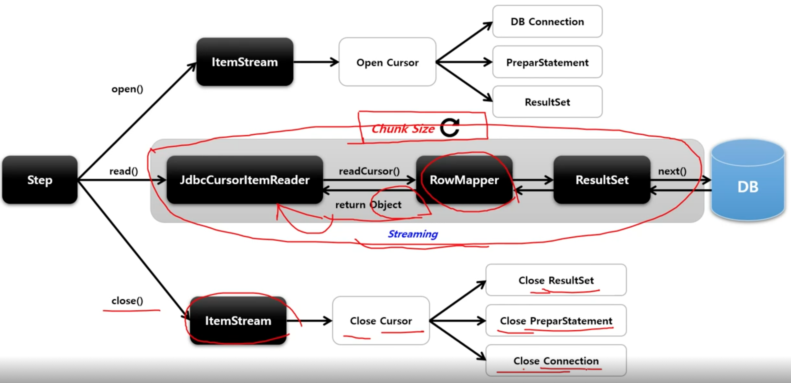

# JdbcCursorItemReader

Cursor 기반의 JDBC 구현체에서 ResultSet 과 함께 사용되며, Datasource 에서 Connection 을 얻어와서 SQL 을 실행한다.

Thread 안정성을 보장하지 않기 때문에 멀티 스레드 환경에서 사용할 경우, 동시성 이슈가 발생하지 않도록 별도 동기화 처리가 필요하다.

## API

```java
public JdbcCursorItemReader itemReader() {
    return new JdbcCursorItemReaderBuilder<T>()
        .name("cursorItemReader")
        // Cursor 방식으로 데이터를 가지고 올 때 한 번에 메모리에 할당할 크기를 설정한다.
        // Chunk Size 와 동일하게 해준다
        .fetchSize(int chunkSize)
        // DB 에 접근하기 위해 DataSource 설정
        .dataSource(DataSource)
        // 쿼리 결과로 반환되는 데이터와 객체를 매핑하기 위한 RowMapper 설정
        .rowMapper(RowMapper)
        // 별도의 RowMapper 를 설정하지 않고 클래스 타입을 설정하면 자동으로 객체와 매핑
        .beanRowMapper(Class<T>)
        // ItemReader 가 조회할 때 사용할 쿼리 문장 설정
        .sql(String sql)
        // 쿼리 파라미터 설정
        .queryArguments(Object... args)
        // 조회할 최대 Item 수
        .maxItemCount(int count)
        // 조회 Item 의 시작 지점
        .currentItemCount(int count)
        // ResultSet 오브젝트가 포함할 수 있는 최대 행수
        .maxRows(int maxRows)
        .build()
}
```

