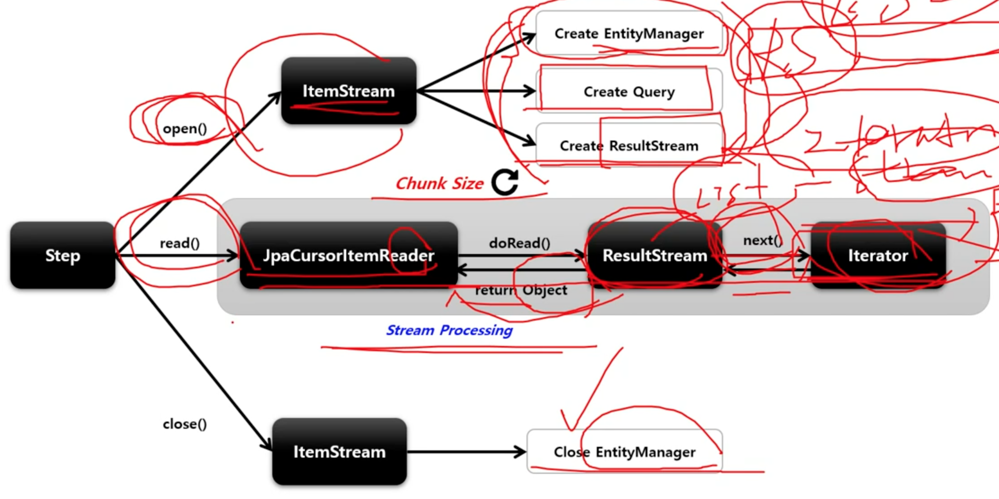

# JpaCursorItemReader

Cursor 기반의 JPA 구현체로서 EntityManagerFactory 객체가 필요하며 쿼리는 JPQL 을 사용한다.

Spring Batch 4.3 버전부터 지원함

> ItemStream 에서 미리 모든 데이터를 가져와서 JpaCursorItemReader 에서 하나하나 처리하는 방식

## API

```java
public JpaCursorItemReader itemReader() {
    return new JpaCursorItemReaderBuilder<T>()
        .name("cursorItemReader")
        // ItemReader 가 조회할 때 JPQL 문장 설정
        .queryString(String JPQL)
        // JPQL 을 실행하는 EntityManager 을 생성하는 팩토리
        .entityManagerFactory(EntityManagerFactory)
        // 쿼리 파라미터 설정
        .parameterValue(Map<String, Object> parameters)
        // 조회할 최대 Item 수
        .maxItemCount(int count)
        // 조회 Item 의 시작 지점
        .currentItemCount(int count)
        .build();
}
```

