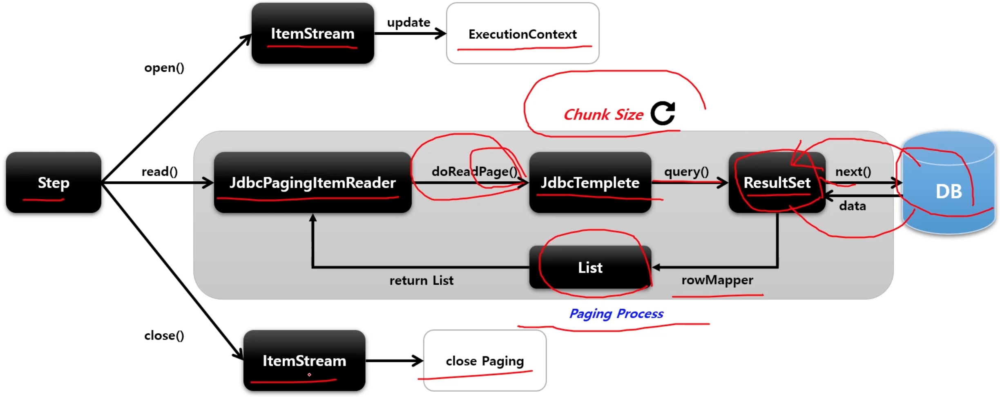

# JdbcPagingItemReader

Paging 기반의 JDBC 구현체로서 쿼리에 시작 행 번호(offset) 과 페이지에서 반환할 행 수 (limit) 를 지정해서 SQL 을 실행한다.

스프링 배치에서 offset 과 limit 을 PageSize 에 맞게 자동으로 생성해 주며 페이징 단위로 데이터를 조회할 때마다 새로운 쿼리가 실행된다.

**페이지마다 새로운 쿼리를 실행하기 때문에 페이징 시 데이터의 순서가 보장될 수 있도록 order by 구문이 작성되도록 한다.**

멀티 스레드 환경에서 Thread 안정성을 보장하기 때문에 별도의 동기화를 할 필요가 없다.

* PagingQueryProvider

쿼리 실행에 필요한 쿼리문을 ItemReader 에게 제공하는 클래스

데이터베이스마다 페이징 전략이 다르기 때문에 각 데이터베이스 유형마다 다른 PagingQueryProvider 를 사용한다.

Select 절, From, sortKey 는 필수로 설정해야 하며 where, group by 절은 필수가 아니다.

SqlPagingQueryProviderFactoryBean 에서 Datasource 설정값을 보고 Provider 중 하나를 자동으로 선택한다.

## API

```java
public JdbcPagingItemReader itemReader() {
    return new JdbcPagingItemReaderBuilder<T>()
        .name("pagingItemReader")
        // 페이지 크기 설정 (쿼리 당 요청할 레코드 수)
        .pageSize(int pageSize)
        // DB 에 접근하기 위해 Datasource 설정
        .dataSource(Datasource)
        // DB 페이징 전략에 따른 PagingQueryProvider 설정
        .queryProvider(PagingQueryProvider)
        // 쿼리 결과로 반환되는 데이터와 객체를 매핑하기 위한 RowMapper 설정
        .rowMapper(Class<T>)
        ///////////////////////// PagingQueryProvider API
        // Select 절 설정
        .selectClause(String selectClause)
        // from 절 설정
        .fromClause(String fromClause)
        // where 절 설정
        .whereClause(String whereClause)
        // group 절 설정
        .groupClause(String groupClause)
        // 정렬을 위한 유니크한 키 설정
        .sortKeys(Map<String, Object> parameters)
        /////////////////////////
        // 쿼리 파라미터 설정
        .parametersValues(Map<String, Object> parameters)
        // 조회할 최대 item 수
        .maxItemCount(int count)
        // 조회 Item 의 시작 지점
        .currentItemCount(int count)
        // ResultSet 오브젝트가 포함될 수 있는 최대 행 수
        .maxRows(int maxRows)
        .build();
}
```

