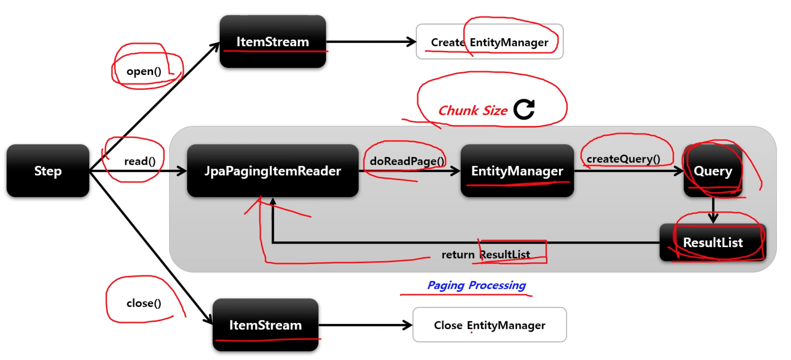

# JpaPagingItemReader

Paging 기반의 JPA 구현체로서 EntityManagerFactory 객체가 필요하며 쿼리는 JPQL 을 사용한다.

## API

```java
public JpaPagingItemReader itemReader() {
    return new JpaPagingItemReaderBuilder<T>()
        .name("pagingItemReader")
        // 페이지 크기 설정 (쿼리당 요청할 레코드 수)
        .pageSize(int count)
        // ItemReader 가 조회할 때 사용할 JPQL 문장 설정
        .queryString(String JPQL)
        // JPQL 을 실행하는 EntityManager 를 생성하는 팩토리
        .entityManagerFactory(EntityManagerFactory)
        // 쿼리 파라미터 설정
        .parameterValue(Map<String, Object> parameters)
        .build();
}
```

