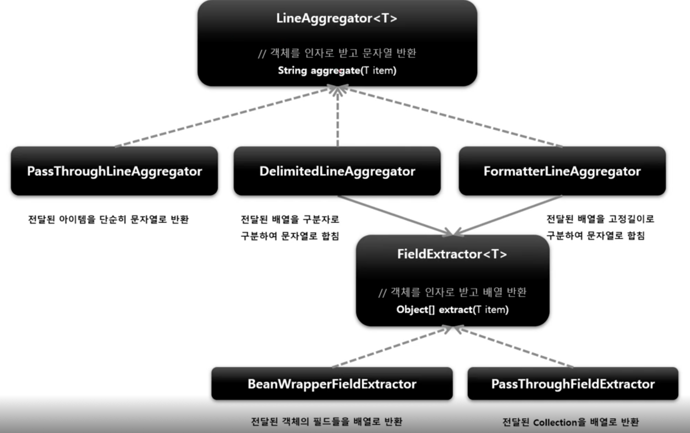
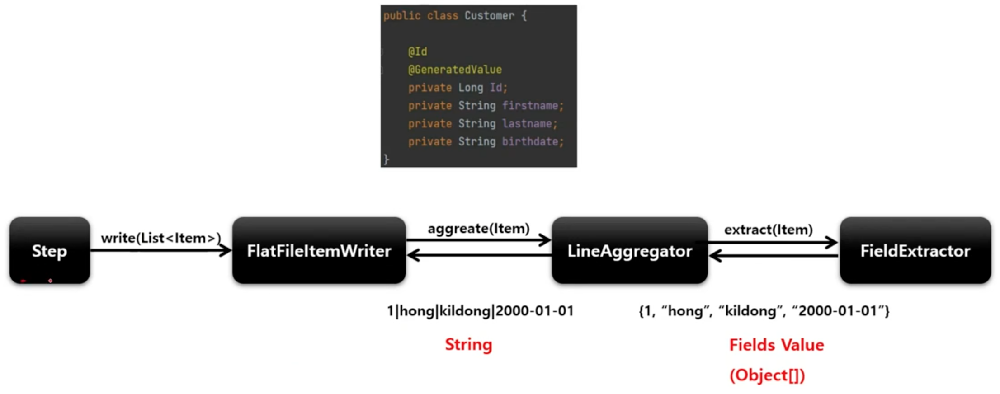
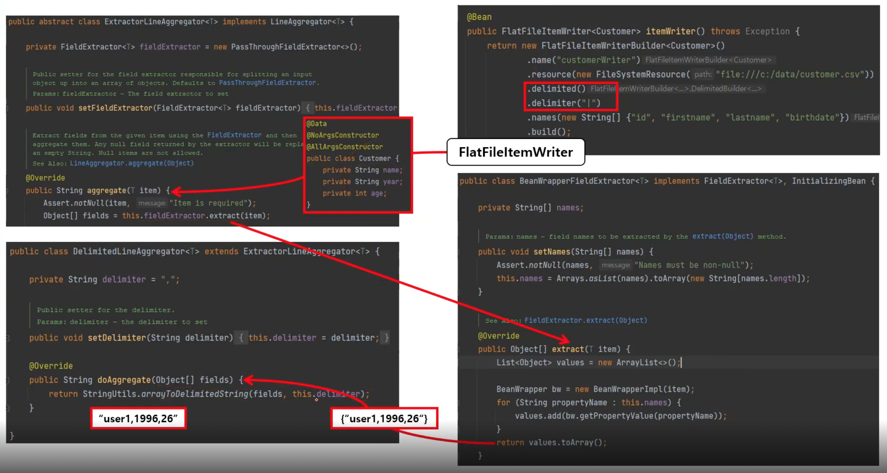
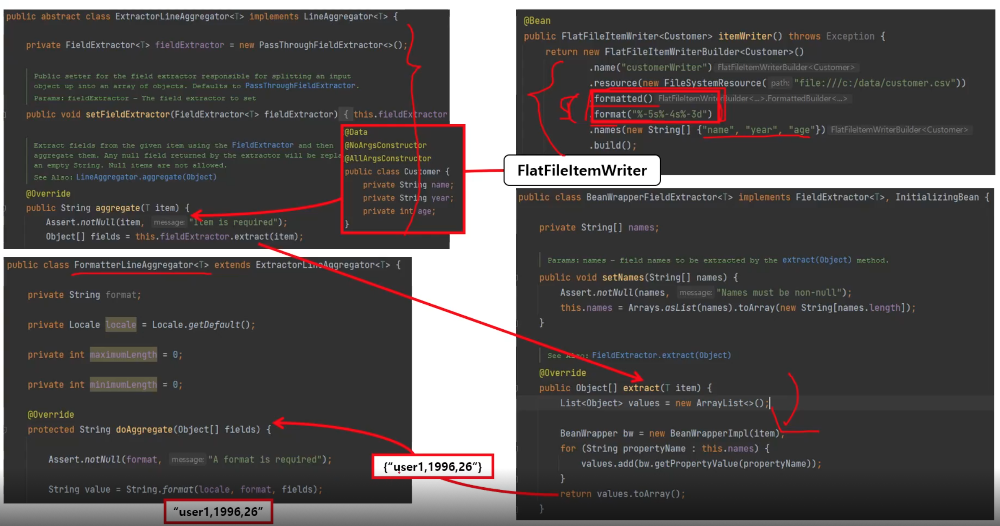

# FlatFileItemWriter

2차원 데이터로 표현된 유형의 파일을 처리하는 ItemWriter

고정 위치로 정의된 데이터 필드나 특수 문자에 의해 구별된 데이터의 행을 기록한다.

Resource 와 LineAggregator 두 가지의 요소가 필요하다.

## 구조

```
FlatFileItemWriter

// 문자열 인코딩. 디폴트는 Charset.defaultCharset()
String encoding = DEFAULT_CHARSET

// 대상 파일이 이미있는 경우 데이터를 계속 추가할 것인지 여부
boolean append = false

// 작성해야 할 리소스
Resource resource

// Object 를 String 으로 변환한다.
LineAggregator<T> lineAggregator

// 헤더를 파일에 쓰기 위한 콜백 인터페이스
FlatFileHeaderCallback headerCallback

// 푸터를 파일에 쓰기 위한 콜백 인터페이스
FlatfileFooterCallback footerCallback
```

### LineAggregator

Item 을 받아서 String 으로 변환하여 반환한다.

FieldExtractor 를 사용해서 처리할 수 있다.

구현체 - PassThroughLineAggregator, DelimitedLineAggregator, FormatterLineAggregator

### FieldExtractor

전달받은 Item 객체의 필드를 배열로 만들고 배열을 합쳐서 문자열을 만들도록 구현하도록 제공하는 인터페이스

구현체 - BeanWrapperFieldExtractor, PassThroughFieldExtractor





## API

```java
public FlatFileItemReader itemReader() {
    return new FlatFileItemWriterBuilder<T>()
        .name(String name)
        // 쓰기할 리소스 설정
        .resource(Resource)
        // 객체를 String 으로 변환하는 LineAggregator 객체 설정
        .lineAggregator(LineAggregator<T>)
        // 존재하는 파일에 내용을 추가할 것인지 여부 설정
        .append(boolean)
        // 객체 필드를 추출해서 배열로 만드는 FieldExtractor 설정
        .fieldExtractor(FieldExtractor<T>)
        // 헤더를 파일에 쓰기 위한 콜백 인터페이스
        .headerCallback(FlatFileHeaderCallback)
        // 푸터를 파일에 쓰기 위한 콜백 인터페이스
        .footerCallback(FlatFileFooterCallback)
        // 파일이 이미 존재한다면 삭제
        .shouldDeleteIfExists(boolean)
        // 파일의 내용이 비어 있다면 삭제
        .shouldDeleteIfEmpty(boolean)
        // 파일의 구분자를 기준으로 파일을 작성하도록 설정
        .delimited().delimiter(String delimiter)
        // 파일의 고정길이를 기준으로 파일을 작성하도록 설정
        .formatted().format(String format)
        .build();
}
```

# DelimitedLineAggregator (구분자 방식)

객체의 필드 사이에 구분자를 삽입해서 한 문자열로 변환한다.

## 구조

```
ExtractorLineAggregator

// 객체를 인자로 받고 배열 반환
FieldExtractor<T> fieldExtractor

// 배열 필드를 문자열로 만들어서 반환
abstract String doAggregate(Object[] fields)
```

```
DelimitedLineAggregator
ExtractorLineAggregator 를 상속

// 구분자. 기본값은 콤마(,)
String delimiter

// 배열 필드를 구분자로 구분해서 문자열로 만든 후 반환
String doAggregate(Object[] fields)
```



# FormatterLineAggregator (고정길이 방식)

객체의 필드를 사용하자가 설정한 Formatter 구문을 통해 문자열로 변환한다.

## 구조

```
FormatterLineAggregator

// 포맷 설정
String format

// 최대 길이 설정
int maximumLength = 0

// 최소 길이 설정
int minimumLength = 0
```

