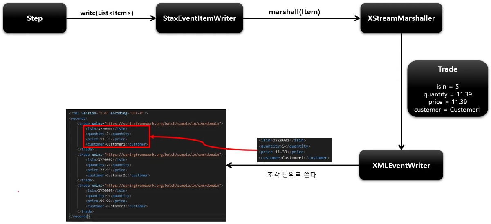

# StaxEventItemWriter

XML 쓰는 과정은 읽기 과정에 대칭적이다.

StaxEventItemWriter 는 Resource, marshaller, rootTagName 가 필요하다.

## API

```java
public StaxEventItemWriter itemWriter() {
    return new StaxEventItemWriterBuilder<T>()
        .name(String name)
        // 쓰기할 리소스 설정
        .resource(Resource)
        // 조각 단위의 루트가 될 이름 설정
        .rootTagName()
        // 파일이 존재하면 덮어쓸 것인지 설정
        .overwriteOutput(boolean)
        // Marshaller 객체 설정
        .marshaller(Marshaller)
        // 헤더를 파일에 쓰기 위한 콜백 인터페이스
        .headerCallback()
        // 푸터를 파일에 쓰기 위한 콜백 인터페이스
        .footerCallback() 
        .build();
}
```



