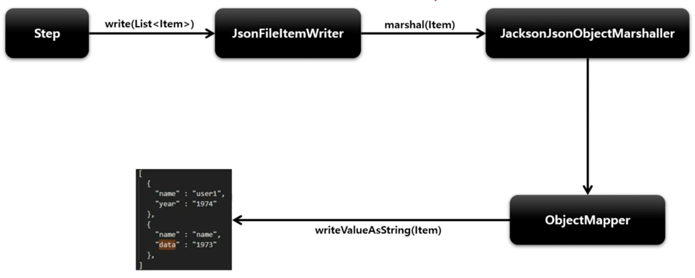

# JsonFileItemWriter

객체를 받아 JSON String 으로 변환하는 역할을 한다.

## API

```java
public JsonFileItemWriterBuilder itemReader() {
    return JsonFileItemWriterBuilder<T>()
        .name(String name)
        // 쓰기할 리소스 설정
        .resource(Resource)
        // 존재하는 파일에 내용을 추가할 것인지 여부 설정
        .append(boolean)
        // JsonObjectMarshaller 객체 설정
        // 보통 JacksonJsonObjectMarshaller
        .jsonObjectMarshaller(jsonObjectMarshaller)
        // 헤더를 파일에 쓰기 위한 콜백 인터페이스
        .headerCallback(FlatFileHeaderCallback)
        // 푸터를 파일에 쓰기 위한 콜백 인터페이스
        .footerCallback(FlatFileFooterCallback)
        // 파일이 이미 존재한다면 삭제
        .shouldDeleteIfExists(boolean)
        // 파일의 내용이 비어 있다면 삭제
        .shouldDeleteIfEmpty(boolean)
        .build();
}
```

