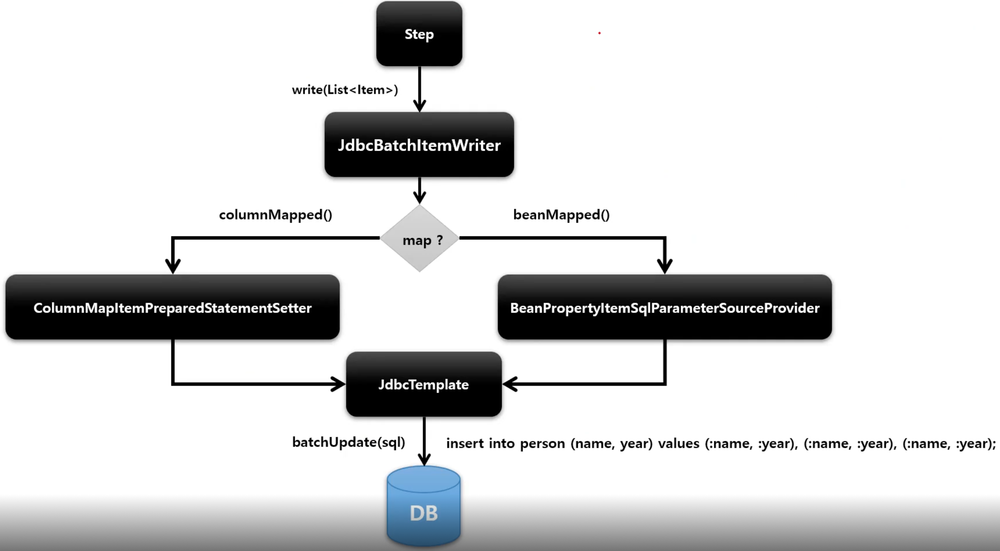
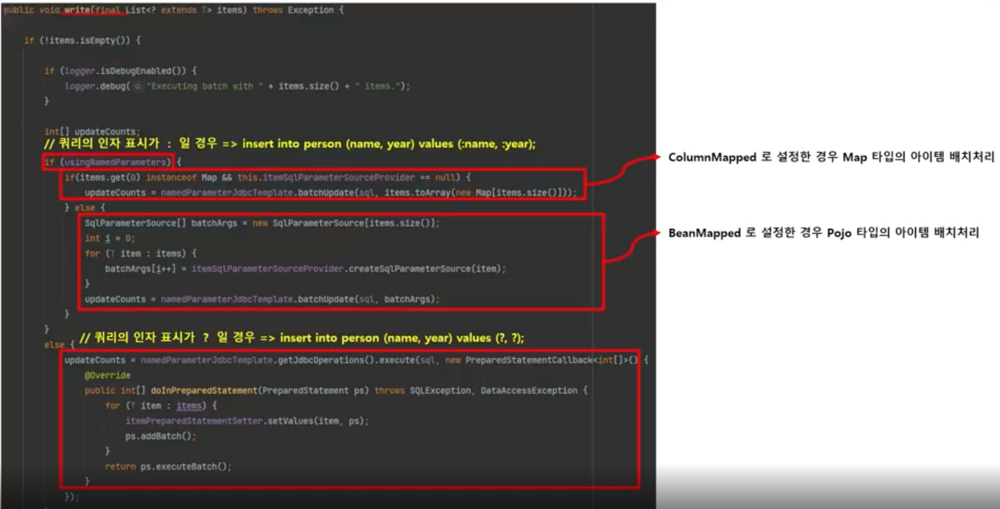

# JdbcBatchItemWriter

JdbcCursorItemReader 설정과 마찬가지로 DataSource 를 지정하고, SQL 속성에 실행할 쿼리를 설정

JDBC 의 Batch 기능을 사용하여 Bulk Insert/Update/Delete 방식으로 처리

단건 처리가 아닌 일괄 처리이기 때문에 성능에 이점을 가진다.

## API

```java
public JdbcBatchItemWriter itemWriter() {
    return new JdbcBatchItemWriterBuilder<T>()
        .name(String name)
        // DB 에 접근하기 위해 Datasource 설정
        .datasource(Datasource)
        // ItemWriter 가 사용할 쿼리 문장 설정
        .sql(String sql)
        // 트랜잭션 이후 적어도 하나의 항목이 행을 업데이트 혹은 삭제하지 않을 경우 예외발생여부를 설정함. 기본값은 true
        .assetUpdates(boolean)
        // POJO 기반으로 Insert SQL 의 Values 를 매핑
        .beanMapped()
        // Key, Value 기반으로 Insert SQL 의 Values 를 매핑
        .columnMapped()
        .build();
}
```



왼쪽은 Map 타입, 오른쪽은 Pojo 타입

