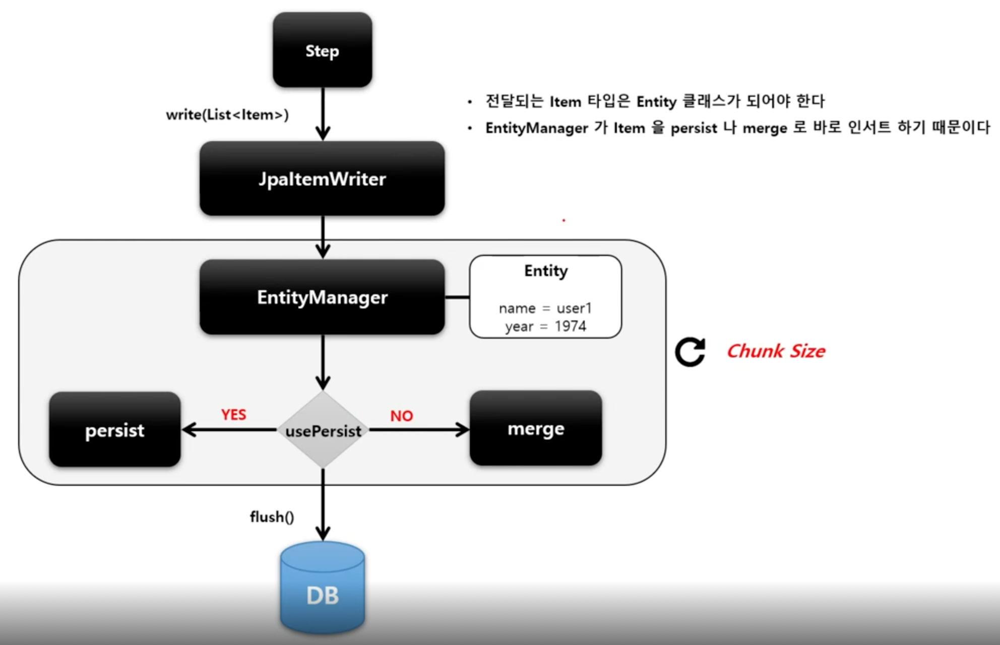

# JpaItemWriter

JPA Entity 기반으로 데이터를 처리하며 EntityManagerFactory 를 주입받아 사용한다.

Entity 를 하나씩 chunk 크기만큼 insert 혹은 merge 한 다음 flush 한다.

ItemReader 나 ItemProcessor 로부터 아이템을 전달받을 때는 Entity 클래스 타입으로 받아야 한다.

## API

```java
public JpaItemWriter itemWriter() {
    return new JpaItemWriterBuilder<T>()
        // Entity 를 persist() 할 것인지 여부 설정. false 이면 merge() 처리
        .usePersist(boolean)
        // EntityManagerFactory 설정
        .entityManagerFactory(EntityManagerFactory)
        .build();
}
```

